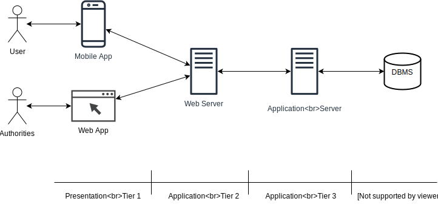
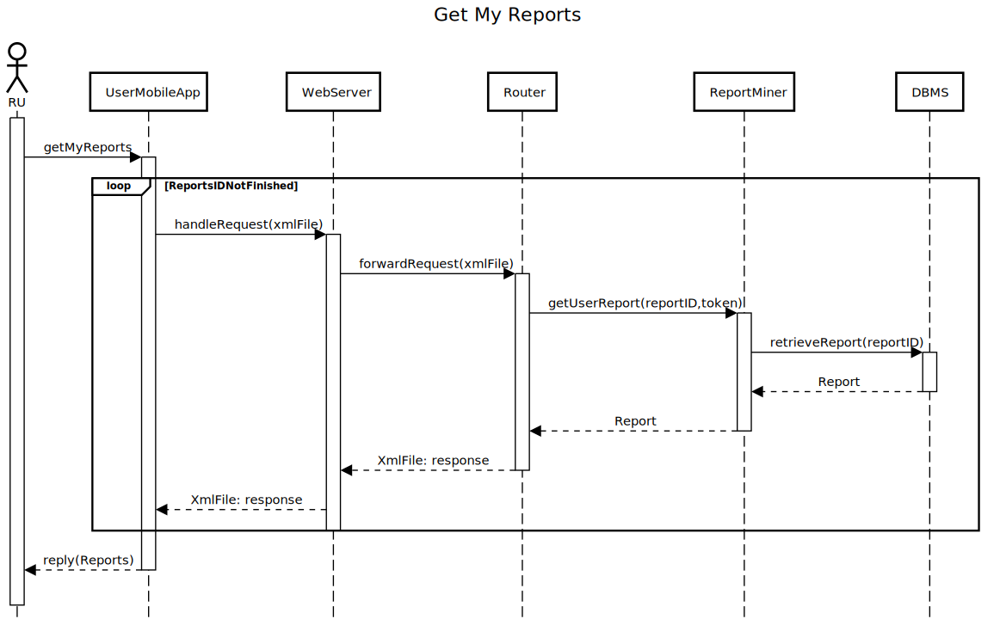
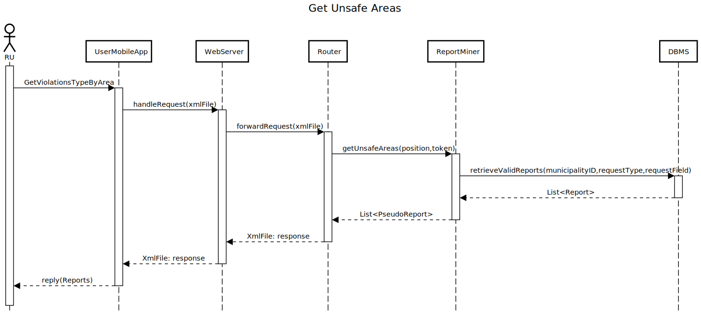
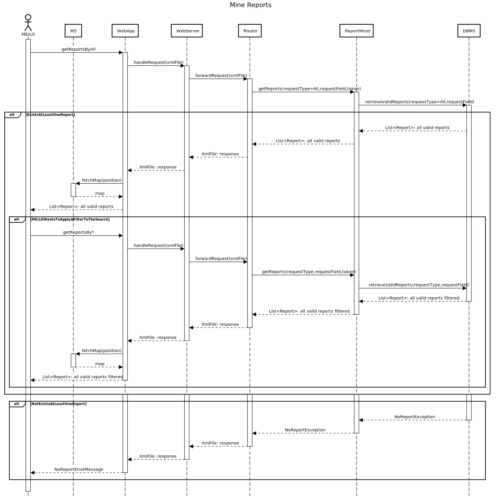
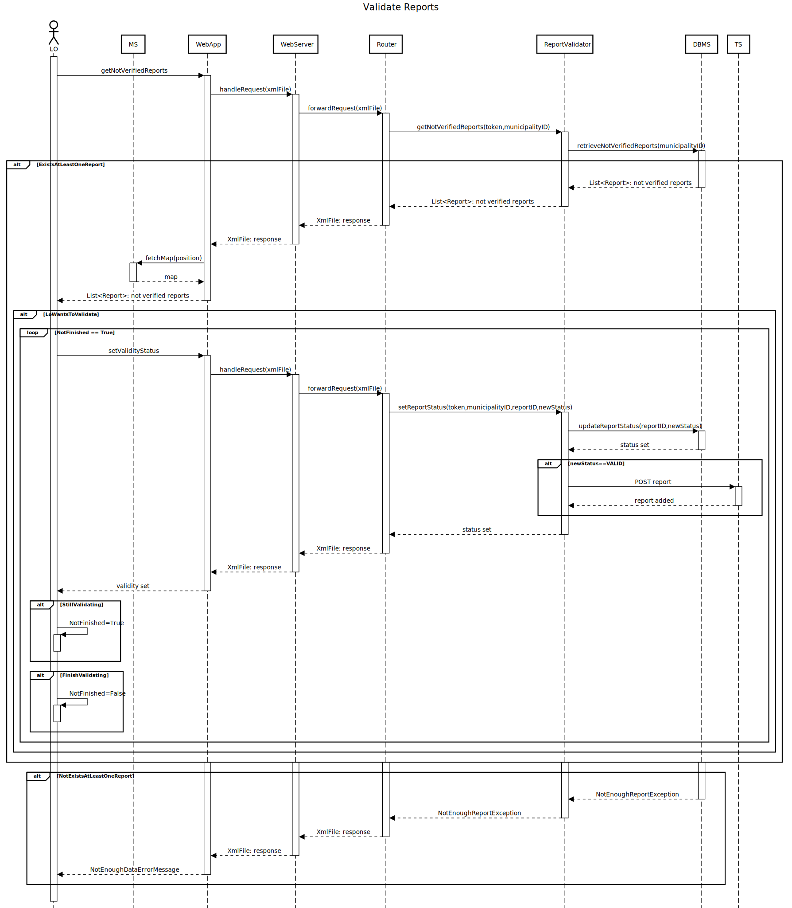
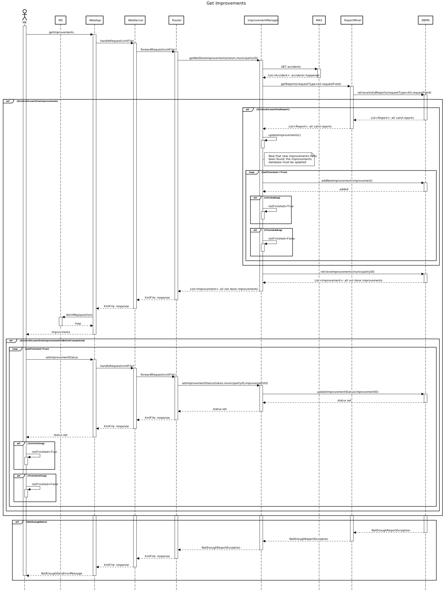
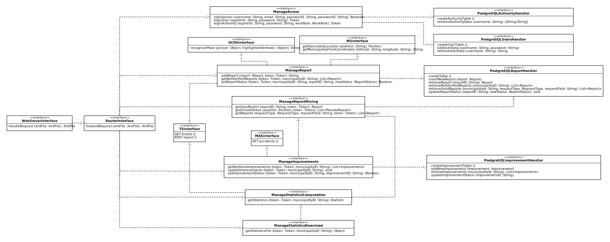
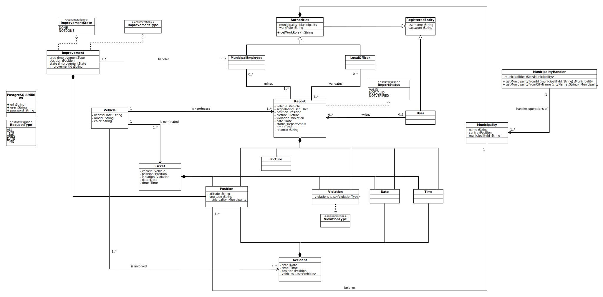

# Architectural Description

## Overview
The product is a distributed application based on the three logic layers of Presentation, that manages the user's interaction with the system, Application, which handles the logic of the system and Data, which manages the information. 

Those three layers are divided onto four different physical tiers. As shown by the following image, Presentation and Data levels reside on a single tier, while Application level is split into two tiers. The first one is the Web Server, 
responsible for the forwarding of requests from the clients and for the caching of static contents, while the second one is the Application Server, which contains the logic of the system. 

 

In order to maximize the scalability of our system, both the Web and Application server follow a scale-out approach: performances improvement is obtained through nodes replication. 
Because of this approach, load-balancing system are used in order to distribute the working load among the various nodes. 
All the nodes of the Application Server use a "share everything" configuration, because there is only one shared database with one point of access. 
Moreover, the Data layer is accomplished by exploiting and external DBMS service already available on the market. In this way we avoid devoting time on difficult
problems about data replication and consistency, which are already solved by the existing and well tested database systems. 

Every communication channel is secured by using firewalls. In this way, the entire Application layer is secured in a DMZ, so attacks and intrusions from malicious 
clients will be prevented. It is important to note that, because the DBMS is located on a different tier with respect to the Application Server, a firewall between them 
can improve the security of the system against malicious attacks coming from the data base, especially in the case of an external DBSM like in our solution. 
Finally, both communication channels between the Application server and other services, like the Ticket service, are secured for the 
same reasons explained above.

## Component view
 
The Component view diagrams represents, explicitly, only the components of the Application server, as they depict the main section of the system. 
Below we will describe in depth the function of every internal server component made ad-hoc for the system (the ones in green).

* **Router**: receives HTTP over SSL/TLS requests following the REST paradigm (see below in the "Component interface" section for further details) and forward them to the others internal components of the Application server. Then forwards the replies
back to the clients. It is relevant to note that temporary tokens are adopted, in order to define which functionalities are accessible for each client. Every client receives its personal token after the login procedure. 
* **UserManager**:
    * **LoginManager**: this component is responsible for granting access to registered users. In particular, the component receives the access credentials and returns an unique token used for further communication
    by the user.
    * **SignUpManager**: this component is responsible for the registration of unregistered users. In particular it receives the new access credentials and save them in the system's database. 
* **ReportManager**:
    * **ReportReceiver**: this component is responsible for receiving the data of new reports and storing them in the database. In particular it takes care of the following tasks:
        * employ the MS apis to retrieve the information about which municipality the report has been created from.
        * recognizing the car's plate in the picture, by employing the OCRS apis. In case of an unrecognizable plate, the report status will be set to "NOTVALID" by default, otherwise it will be "NOTVERIFIED" (which means that a local officer has still to prove its validity).
        * saving the report in the system's database.
    * **ReportValidator**: this component is responsible for two main operations:
        * fetching, from the database, of reports with status set to "NOTVERIFIED".
        * modification of status of a set of report, by changing if from "NOTVERIFIED" to "VALID" or "NOTVALID" according to the request sent by the local officer. Then it saves them in the database and sends them to the TS, responsible for issuing traffic tickets.
* **ReportMiner**: this component is responsible for obtaining reports by querying the database. It is crucial to note that the request of the authority can come from directly from the Router of from other components like the ImprovementsManager and StatisticsComputationManager. In both cases, authority's municipality is used for filtering reports. Only reports with status set to "VALID" are fetched. Various form of mining can be performed, in particular it's is possible to mine:
    * All: all the reports produced in the same municipality of the authority, who has issued the request, are returned.
    * By Type: between all the reports produced in the same municipality of the authority, who has issued the request, only those which have the given violation's type are returned.
    * By Date: between all the reports produced in the same municipality of the authority, who has issued the request, only those which were composed on the given date are returned.
    * By Time: between all the reports produced in the same municipality of the authority, who has issued the request, only those which were composed on the given time, regardless the date, are returned.
    * By Area: between all the reports produced in the same municipality of the authority, who has issued the request, only those which were composed in the given area, defined by a center and a radius, are returned.
    
* **ImprovementManager**: this component is responsible for getting the possible improvements belonging to the requesting authority's municipality and for setting their status. In order to determine the possible improvements, it crosses the data
coming from the external MAS and from the MineReports component. When a new improvement is determined, it's status is set by default to "NOTDONE" and it is saved in the database. When no further improvements can be discovered, all those which have the status set to "NOTDONE" 
are returned to the requester. Moreover, through this component, an authority can set the status of a specific improvement to "DONE", after fetching all the possible one as described before.  
* **StatisticsComputationManager**: this component is responsible for building statistics, belonging to the requesting authority's municipality, about the violations and the 
perpetrators who cause them by crossing the information coming from reports received by the ReportMiner and from issued tickets coming from the TS. 
It is important to note that statistics are always crunched on request and never saved on the server, because they can change at any time. 
* **StatisticsDownloadManager**: this component is responsible for creating a non materialized document (which means it is not saved on server side, but only generated
and sent) about the statistics, belonging to the requesting authority's municipality, 
by fetching them from the StatisticsComputationManager. The resulting document is returned to the caller.
## Deployment view
 

This picture shows how the system should be deployed: 

* It is available for end users as a Mobile application, while, for authorities, as a Web application, accessible both from Mobile and PC.
* The Web server, deployed on its physical node, has the purpose of caching static contents (which are, for example, .html and .css files) for the Web application. 
Every other request received from the clients (both the Web and Mobile application) is automatically forwarded to the Application server. 
* The Application server and the Database server are deployed on two different physical nodes, in order to have more security for data and to achieve a decoupled architecture. 
Other external services has been ignored for this view.

## Runtime view
The following section contains the most important RuntimeView, organized by the previous depicted UseCases (see RASD document for further info).
In order to simplify the complexity of those diagrams, we decided to omit access errors (which happen when the provided token 
does not authorize the requested operation) and database'access errors. Moreover, the WebServer forwards every request, but in case of static contents request, it can reply directly without contacting the router. 
###RegisteredUser
####Add Report
 

In this sequence diagram the process through a RU adds a report to the system is shown. At first the RU chooses the "addReport" functionality 
on the UserMobileApp. Then the app fetched a map from the MS and forward the request to the Web Server, which contacts the Router. 
So, the Router forward the request to the ReportReceiver, which tries to recognize the plate with the help of the OCRS, gets the municipality where the report has been issued through the MS and, finally, adds 
the report to the database through the DBMS. 

####Get MyReports
 

In this sequence diagram the process through a RU gets all the reports he/she has issued is shown. At first the RU chooses the "getMyReports" functionality
on the UserMobileApp. Then the app starts fetching, one by one, all the reports issued by the user. In particular, every request passes through the WebServes, Router, ReportMiner and finally the DBMS, then
is goes back to the UserMobileApp. Once all the reports have been fetched, they are presented to the RU.

####Get Unsafe Areas
 

semplice richiesta, descrivere i componenti per cui passa come sopra. 

###MunicipalEmployee and LocalOfficer
####Get Statistics
 

inizio la richiseta. 
Chiedo al ticket service i ticket emessi per calcolare le statistiche.
poi chiedo al report miner i report.
Se ci sono abbastanza report vengono ritornati al statistics computaiton manager che calcola le statistiche e le presenta al me/lo.
se eventualmente il me/lo vuole scaricarle, si passa per statisticsdownloadmanager che farà fare la stessa cosa di prima, solo che cè un passaggio in più in cui si crea il file delle statistiche. 
####Mine Reports
 

parte richiesta.
prima vengono chiesti tutti quanti (requestType=ALL) per presentarli al me/lo.
La richiesta arriva al database e, se ci sono reports nella sua municipality, vengono ritornati. Eventualmente il me/lo può applicare dei filtri alla ricerca -> come prima, solo che adesso non sarà più di tipo ALL.

###LocalOfficer
####Validate Reports
 

parte la richiesta.
si arriva al database, si vede se ci sono reports da validare.
In caso positivo vengono ritornati al LO (la WeBApp nel mentre prende anche la mappa).
Se poi il LO vuole settare la validità:
loop in cui si setta la validità per ogni report. Importante è che se un report è settato valido allora viene salvato nel ticket service TS. 

###MunicipalEmployee
####Get Improvements
 

parte la richiesta.
Importante è che si chiedono al MAS gli incidenti avvenuti nella municpality indicata dal municiplityID. Poi si contatta il database.
Se è possibile proporre almeno un improvement si vanno le seguenti cose:
Se esiste almeno un report si aggiornano i possibili improvements e, uno per uno, vengono aggiunti al database.
Poi si chiedono al database tutti i possibili improvements e vengono ritornati al ME (si prende anche la mappa sulla WebAPP).
Se poi cè qualche improvements da settare come "DONE", si fa un loop e si validano uno ad uno, aggiornando lo stato di ogni improvement nel database.

## Component interfaces

The following picture contains all the used interface in the system.

 

As the development continued, the class diagram introduced in the RASD document has been updated. So we decided to 
report here the new version, with classes used by the interfaces described below .

 

Down we start the interfaces'description from the REST interface connecting the applications and the Web server.

### Web server interface and Report interface

For the Web server interface and the Report interface a RESTful api has been chosen. Since both interfaces are a vital part of the system, and the components that they connect belongs to the part that will be implemented, they will be discussed in depth.

#### REST table of resources

The following table represents the logic structures of the resources of the system and the operation that can be done on them.

| URI | POST | GET | PUT | DELETE |
| ---- | ---- | ---- | ---- | ---- |
| /users/registration/?id=xxx | X | - | - | - |
| /users/login/?id=xxx | - | X | - | - |
| /users/authorities/login/?id=xxx | - | X | - | - |
| /reports/default | X | - | - | - |
| /reports/default/?id=xxx | - | X | - | - |
| /reports/default/unsafearea | - | X | - | - |
| /reports/notverified/?id=xxx | - | X | X | - |
| /reports/valid/?id=xxx | - | X | - | - |
| /improvements/?id=xxx | - | X | X | - |
| /statistics/visualize/?id=xxx | - | X | - | - |
| /statistics/download/?id=xxx | - | X | - | - |

"X" : the operation is applicable on the resource
 
"-" : the operation is inapplicable on the resource

Here a quick description of the resources group:

* */users/** represents the information related to the users, in particular their account information 
* */reports/default/** represents the resources accessible by the RU, in particular reports and "pseudo report" for the unsafe areas. These resources will be greatly used by the mobile app.
* */reports/notverified/** contains all the received reports that haven't been immediately discarded by the OCR but are still on impending evaluation by a LO 
* */reports/valid/** contains all the received reports that have been judged as valid by a LO
* */improvements/** contains the improvements suggested to a municipality that can be retrieved by a ME
* */statistics/** contains the statistics that can be retrieved by a ME

#### General request description 

The data that will be transmitted will be composed of XML files.

To recognize the user who sent a request to the server, the system will employ tokens. 
A token is a string that is provided to the user as an answer to the login, it contains information on the user and will always be part of the requests, except the login and sign up.
The contained information will be:

* User type information: the different type users (RU, LO and ME) will be identified in different ways to avoid ambiguity. Moreover the identifier for LO and ME will contain an identifier for the Municipality they work for
* User identifier: The single user will be identified to have information on who is making the request and give the correct permission to access data.
* Creation time: The token is a "one time only" use. Its validity is fixed and will generally last at least for a session, this permits to recycle pieces of tokens and avoids the malicious use of old ones to get data.

The tokens will be structured in a way that will be impossible to decipher by malevolent parties and that will guarantee legitimacy for each request.

#### Detailed requests

**POST**   &nbsp;&nbsp;&nbsp;&nbsp;/users/registration/?id={id}

This request is used to register a user.

**Parameters**

| Field | Type | Description |
| ---- | ---- | ---- |
|  id | String | The username of the user who is trying to register |

**Fields**

| Field | Type | Description |
| ---- | ---- | ---- |
| email | String | The email of the user |
| passwordFirst | String | The password of the user |
| passwordSecond | String | The same password as before, used to confirm the first password |

**Success 201** (resource created)

**Error 401** (Unauthorized)

| Field |  Description |
| ---- |  ---- |
| ExistingUsername | Someone with the same username is already registered |
| DifferentPassword | The second password is different from the first one |
| ExistingMail | This email is already associated with another account |

------------------------------------------------------------------------------------------------------------------------------------

**GET**   &nbsp;&nbsp;&nbsp;&nbsp;/users/login/?id={id}

This request allows a RU to login. 

**Parameters**

| Field | Type | Description |
| ---- | ---- | ---- |
|  id | String | The username of the user who is trying to login |

**Fields**

| Field | Type | Description |
| ---- | ---- | ---- |
| loginInformation | String | The email or username of the user |
| password | String | The password of the user |

**Success 200** (request OK)

| Field | Type | Description |
| ---- | ---- | ---- |
| token | String | A token that represents the user |
| reportIDs | String[] | The list of id associated with the reports uploaded by the user |

**Error 401** (Unauthorized)

| Field |  Description |
| ---- |  ---- |
| WrongUsernameOrPassword | The written username and password does not correspond to any existing user |

------------------------------------------------------------------------------------------------------------------------------------

**GET**   &nbsp;&nbsp;&nbsp;&nbsp;/users/authorities/login/?id={id}

This request allows a ME or LO to login. 

**Parameters**

| Field | Type | Description |
| ---- | ---- | ---- |
|  id | String | The username of the user who is trying to login |

**Fields**

| Field | Type | Description |
| ---- | ---- | ---- |
| loginInformation | String | The username of the user |
| password | String | The password of the user |
| workRole | String | This will be 'ME' or 'LO' |

**Success 200** (request OK)

| Field | Type | Description |
| ---- | ---- | ---- |
| token | String | A token that represents the user and the municipality he/she works in|
| municipalityID| String | The id of the municipality where the ME or LO works, this will be a parameter for the following requests |

**Error 401** (Unauthorized)

| Field |  Description |
| ---- |  ---- |
| WrongUsernameOrPassword | The written username and password does not correspond to any existing user |
| NotCorrespondingRole | The selected work role does not correspond to the user which given login and password corresponds to |

------------------------------------------------------------------------------------------------------------------------------------

**POST**   &nbsp;&nbsp;&nbsp;&nbsp;/reports/default

This request adds a report to the system.

**Fields**

| Field | Type | Description |
| ---- | ---- | ---- |
| vehicle | Object | The vehicle information |
| &nbsp;&nbsp;&nbsp;&nbsp;licensePlate | String | The license plate of the vehicle |
| position | Object | The position, expressed in DMS, of the vehicle when the report was submitted  |
| &nbsp;&nbsp;&nbsp;&nbsp;latitude | String | The latitude where the vehicle was recorded to be |
| &nbsp;&nbsp;&nbsp;&nbsp;longitude | String | The longitude where the vehicle was recorded to be |
| picture | Object | Representation of the image of the vehicle |
| violation | Object[] | An array of the type of violation |
| &nbsp;&nbsp;&nbsp;&nbsp;violationType | String | The type of violation |
| date | String | The datetime in dd-MM-yyyyThh:mm:ss format |
| highlightVertexes | Object | The coordinates on the picture of where the license plate is located |
| &nbsp;&nbsp;&nbsp;&nbsp;vertexOne | Number[] | The coordinates of the first vertex |
| &nbsp;&nbsp;&nbsp;&nbsp;vertexTwo | Number[] | The coordinates of the second vertex |
| &nbsp;&nbsp;&nbsp;&nbsp;vertexThree | Number[] | The coordinates of the third vertex |
| &nbsp;&nbsp;&nbsp;&nbsp;vertexFour | Number[] | The coordinates of the fourth vertex |

**Success 201** (resource created)

| Field | Type | Description |
| ---- | ---- | ---- |
| id | String | The id that the system has assigned to the sent report, this id will uniquely identify the report and will also contain information about the user which sent it |

------------------------------------------------------------------------------------------------------------------------------------

**GET**   &nbsp;&nbsp;&nbsp;&nbsp;/reports/default/?id={id}

This request retrieves a report form the system.

**Parameters**

| Field | Type | Description |
| ---- | ---- | ---- |
| id | String | The id that uniquely identifies the report that the user wants to see|

**Success 200** (request OK)

| Field | Type | Description |
| ---- | ---- | ---- |
| vehicle | Object | The vehicle information |
| &nbsp;&nbsp;&nbsp;&nbsp;licensePlate | String | The license plate of the vehicle |
| position | Object | The position, expressed in DMS, of the vehicle when the report was submitted  |
| &nbsp;&nbsp;&nbsp;&nbsp;latitude | String | The latitude where the vehicle was recorded to be |
| &nbsp;&nbsp;&nbsp;&nbsp;longitude | String | The longitude where the vehicle was recorded to be |
| picture | Object | Representation of the image of the vehicle |
| violation | Object[] | An array of the type of violation |
| &nbsp;&nbsp;&nbsp;&nbsp;violationType | String | The type of violation |
| date | String | The datetime in dd-MM-yyyyThh:mm:ss format |

**Error 403** (forbidden)

| Field | Description |
| ---- | ---- |
| UserNotAuthorized | The id of the report and the token of the user have been analyzed. It was found that the user was not the one who submitted the report and as such the RU was not permitted to see the report  |

**Error 404** (resource not found)

| Field | Description |
| --- | --- |
| NoReportError | The requested resource caused an error on the database, this could both mean that the resource was not found on the database or that the database had internal error or an error on the connection | 

------------------------------------------------------------------------------------------------------------------------------------

**GET**   &nbsp;&nbsp;&nbsp;&nbsp;/reports/default/unsafearea

This request retrieves the type of violations in certain area.

**Fields**

| Field | Type | Description |
| ---- | ---- | ---- |
| position | Object | The position, expressed in DMS, of the center of the area which the RU wants to know about |
| &nbsp;&nbsp;&nbsp;&nbsp;latitude | String | The latitude where the vehicle was recorded to be |
| &nbsp;&nbsp;&nbsp;&nbsp;longitude | String | The longitude where the vehicle was recorded to be |

**Success 200** (request OK)

| Field | Type | Description |
| ---- | ---- | ---- |
| pseudoReport | Object[] | The list of partial reports that can be seen bya a RU |
| &nbsp;&nbsp;&nbsp;&nbsp;position | Object | The position, expressed in DMS, of the vehicle when the report was submitted  |
| &nbsp;&nbsp;&nbsp;&nbsp;&nbsp;&nbsp;&nbsp;&nbsp;latitude | String | The latitude where the vehicle was recorded to be |
| &nbsp;&nbsp;&nbsp;&nbsp;&nbsp;&nbsp;&nbsp;&nbsp;longitude | String | The longitude where the vehicle was recorded to be |
| &nbsp;&nbsp;&nbsp;&nbsp;violation | Object[] | An array of the type of violation |
| &nbsp;&nbsp;&nbsp;&nbsp;&nbsp;&nbsp;&nbsp;&nbsp;violationType | String | The type of violation |

**Error 404** (resource not found)

| Field | Description |
| --- | --- |
| NoReportError | The requested resource caused an error on the database, this could both mean that the resource was not found on the database or that the database had internal error or an error on the connection | 

------------------------------------------------------------------------------------------------------------------------------------

**GET**   &nbsp;&nbsp;&nbsp;&nbsp;/reports/notverified/?id={id}

This request retrieves the reports that are waiting for validation in a certain municipality.

**Parameters**

| Field | Type | Description |
| ---- | ---- | ---- |
| id | String | The id that uniquely identifies the municipality which the LO works for |

**Success 200** (request OK)

| Field | Type | Description |
| ---- | ---- | ---- |
| reports | Object[] | A list of the valid reports of a certain municipality |
| &nbsp;&nbsp;&nbsp;&nbsp;reportId | String | The string that uniquely identifies a report |
| &nbsp;&nbsp;&nbsp;&nbsp;vehicle | Object | The vehicle information |
| &nbsp;&nbsp;&nbsp;&nbsp;&nbsp;&nbsp;&nbsp;&nbsp;licensePlate | String | The license plate of the vehicle |
| &nbsp;&nbsp;&nbsp;&nbsp;position | Object | The position, expressed in DMS, of the vehicle when the report was submitted  |
| &nbsp;&nbsp;&nbsp;&nbsp;&nbsp;&nbsp;&nbsp;&nbsp;latitude | String | The latitude where the vehicle was recorded to be |
| &nbsp;&nbsp;&nbsp;&nbsp;&nbsp;&nbsp;&nbsp;&nbsp;longitude | String | The longitude where the vehicle was recorded to be |
| &nbsp;&nbsp;&nbsp;&nbsp;picture | Object | Representation of the image of the vehicle |
| &nbsp;&nbsp;&nbsp;&nbsp;violation | Object[] | An array of the type of violation |
| &nbsp;&nbsp;&nbsp;&nbsp;&nbsp;&nbsp;&nbsp;&nbsp;violationType | String | The type of violation |
| &nbsp;&nbsp;&nbsp;&nbsp;date | String | The datetime in dd-MM-yyyyThh:mm:ss format |

**Error 403** (forbidden)

| Field | Description |
| ---- | ---- |
| UserNotAuthorized | The id of the municipality and the token of the user have been analyzed. It was found that the user was not an LO or the LO's municipality was not the one of the reports requested|

**Error 404** (resource not found)

| Field | Description |
| --- | --- |
| NoReportError | The requested resource caused an error on the database, this could both mean that the resource was not found on the database or that the database had internal error or an error on the connection | 

--------------------------------------------------------------------------------------------------------------------------------------

**PUT**   &nbsp;&nbsp;&nbsp;&nbsp;/reports/notverified/?id={id}

This request modifies the status of a report. 

**Parameters**

| Field | Type | Description |
| ---- | ---- | ---- |
| id | String | The id that uniquely identifies the municipality which the LO works for |

**Fields**

| Field | Type | Description |
| ---- | ---- | ---- |
| id | String | The id of the report |
| newStatus | String | The result of the validation performed by the LO |

**Error 403** (forbidden)

| Field | Description |
| ---- | ---- |
| UserNotAuthorized | The id of the municipality and the token of the user have been analyzed. It was found that the user was not an LO or the LO's municipality was not the one of the reports requested |

----------------------------------------------------------------------------------------------------------------------------------------
**GET**   &nbsp;&nbsp;&nbsp;&nbsp;/reports/valid/?id={id}

This request gets all the valid reports in a certain municipality.

**Parameters**

| Field | Type | Description |
| ---- | ---- | ---- |
| id | String | The id that uniquely identifies the municipality which the LO works for |

**Fields**

| Field | Type | Description |
| ---- | ---- | ---- |
| requestType | String | The type of request issued (i.e. "by area") |
| requestField| String | The field that contains precise information on the request |

**Success 200** (request OK)

| Field | Type | Description |
| ---- | ---- | ---- |
| reports | Object[] | A list of the valid reports of a certain municipality |
| &nbsp;&nbsp;&nbsp;&nbsp;reportId | String | The string that uniquely identifies a report |
| &nbsp;&nbsp;&nbsp;&nbsp;vehicle | Object | The vehicle information |
| &nbsp;&nbsp;&nbsp;&nbsp;&nbsp;&nbsp;&nbsp;&nbsp;licensePlate | String | The license plate of the vehicle |
| &nbsp;&nbsp;&nbsp;&nbsp;position | Object | The position, expressed in DMS, of the vehicle when the report was submitted  |
| &nbsp;&nbsp;&nbsp;&nbsp;&nbsp;&nbsp;&nbsp;&nbsp;latitude | String | The latitude where the vehicle was recorded to be |
| &nbsp;&nbsp;&nbsp;&nbsp;&nbsp;&nbsp;&nbsp;&nbsp;longitude | String | The longitude where the vehicle was recorded to be |
| &nbsp;&nbsp;&nbsp;&nbsp;picture | Object | Representation of the image of the vehicle |
| &nbsp;&nbsp;&nbsp;&nbsp;violation | Object[] | An array of the type of violation |
| &nbsp;&nbsp;&nbsp;&nbsp;&nbsp;&nbsp;&nbsp;&nbsp;violationType | String | The type of violation |
| &nbsp;&nbsp;&nbsp;&nbsp;date | String | The datetime in dd-MM-yyyyThh:mm:ss format |

**Error 403** (forbidden)

| Field | Description |
| ---- | ---- |
| UserNotAuthorized | The id of the municipality and the token of the user have been analyzed. It was found that the user was not an LO or the LO's  municipality was not the one of the reports requested  |

**Error 404** (resource not found)

| Field | Description |
| --- | --- |
| NoReportError | The requested resource caused an error on the database, this could both mean that the resource was not found on the database or that the database had internal error or an error on the connection | 

----------------------------------------------------------------------------------------------------------------------------------------

**GET**   &nbsp;&nbsp;&nbsp;&nbsp;/improvements/?id={id}

This request retrieves all the suggested improvements in a certain municipality.

**Parameters**

| Field | Type | Description |
| ---- | ---- | ---- |
| id | String | The id that uniquely identifies the municipality which the ME works for |

**Success 200** (request OK)

| Field | Type | Description |
| ---- | ---- | ---- |
| improvements | Object[] | The list of suggested improvements |
| &nbsp;&nbsp;&nbsp;&nbsp;type | String | The of the improvement, i.e. "add a cycling lane" |
| &nbsp;&nbsp;&nbsp;&nbsp;position | Object | The position of the improvement expresses in DMS |
| &nbsp;&nbsp;&nbsp;&nbsp;&nbsp;&nbsp;&nbsp;&nbsp;latitude | String | The latitude where the suggested improvement will be expected to be |
| &nbsp;&nbsp;&nbsp;&nbsp;&nbsp;&nbsp;&nbsp;&nbsp;longitude | String |The longitude where the suggested improvement will be expected to be  |
| &nbsp;&nbsp;&nbsp;&nbsp;state | String | The status of the improvement, it could be "DONE" or "NOT DONE" |
| &nbsp;&nbsp;&nbsp;&nbsp;improvementId | String | The id that uniquely identifies the improvement on the database |

**Error 403** (forbidden)

| Field | Description |
| ---- | ---- |
| UserNotAuthorized | The id of the municipality and the token of the user have been analyzed. It was found that the user was not an ME or the ME's  municipality was not the one of the reports requested  |

**Error 404** (resource not found)

| Field | Description |
| --- | --- |
| NotEnoughReportError | The requested improvements could not be found on the database and the available information on the Municipality is not enough to compute correct suggestions | 

----------------------------------------------------------------------------------------------------------------------------------------

**PUT**   &nbsp;&nbsp;&nbsp;&nbsp;/improvements/?id={id}

This request modifies the status of an improvement from "not done" to "done".

**Parameters**

| Field | Type | Description |
| ---- | ---- | ---- |
| id | String | The id that uniquely identifies the municipality which the LO works for |

**Fields**

| Field | Type | Description |
| ---- | ---- | ---- |
| improvementId | String | The id that uniquely identifies the improvement on the database |

**Error 403** (forbidden)

| Field | Description |
| ---- | ---- |
| UserNotAuthorized | The id of the municipality and the token of the user have been analyzed. It was found that the user was not an ME or the ME's municipality was not the one of the reports requested |

----------------------------------------------------------------------------------------------------------------------------------------

**GET**  &nbsp;&nbsp;&nbsp;&nbsp; /statistics/visualize/?id={id}

This request gets the available statistics on a certain municipality and lets the ME visualize them.

**Parameters**

| Field | Type | Description |
| ---- | ---- | ---- |
| id | String | The id that uniquely identifies the municipality which the LO works for |

**Success 200** (request OK)

| Field | Type | Description |
| ---- | ---- | ---- |
| statistics | Object[] | The various statistics |
|&nbsp;&nbsp;&nbsp;&nbsp; firstFieldName | String | The name of the first field of the graph |
|&nbsp;&nbsp;&nbsp;&nbsp; secondFieldName | String | The name of the second field of the graph |
|&nbsp;&nbsp;&nbsp;&nbsp; firstFieldValues | Number[] | The values of the first field |
|&nbsp;&nbsp;&nbsp;&nbsp; secondFieldValues | Number[] | The value of the second field |

**Error 403** (forbidden)

| Field | Description |
| ---- | ---- |
| UserNotAuthorized | The id of the municipality and the token of the user have been analyzed. It was found that the user was not an ME or the ME's  municipality was not the one of the reports requested  |

**Error 404** (resource not found)

| Field | Description |
| --- | --- |
| NotEnoughReportError | The requested statistics could not be found on the database and the available information on the Municipality is not enough to compute accurate statistics | 

-----------------------------------------------------------------------------------------------------

**GET**  &nbsp;&nbsp;&nbsp;&nbsp; /statistics/download/?id={id}

This request gets the url of the pdf file where the visualized statistics are written.

**Parameters**

| Field | Type | Description |
| ---- | ---- | ---- |
| id | String | The id that uniquely identifies the municipality which the LO works for |

**Success 200** (request OK)

| Field | Type | Description |
| ---- | ---- | ---- |
| url | String | The url where the ME can download the pdf file |

**Error 403** (forbidden)

| Field | Description |
| ---- | ---- |
| UserNotAuthorized | The id of the municipality and the token of the user have been analyzed. It was found that the user was not an ME or the ME's  municipality was not the one of the reports requested  |

**Error 404** (resource not found)

| Field | Description |
| --- | --- |
| NotEnoughReportError | The requested statistics could not be found on the database and the available information on the Municipality is not enough to compute accurate statistics | 

### TS interface and MAS interface

Since both the TS and the MAS are optional external services which are not completely specified it will be assumed that their communication interfaces will be provided trough RESTful api
given the fact that a stateless communication will ease the load on both our system and the Municipality's system. There will be assumptions only on the expected response for the GET requests and for the POST only the field of the message will be described.
Both the URIs, controls on accesses and security will be overlooked. 

#### Request of data about accidents from the MAS

This request will be structured as a GET and the expected success message will be structured as follows. 

| Field | Type | Description |
| ---- | ---- | ---- |
| accidents | Object[] | The list of accidents that a Municipality can provide |
| &nbsp;&nbsp;&nbsp;&nbsp;date | String | The datetime in dd-MM-yyyyThh:mm:ss format |
| &nbsp;&nbsp;&nbsp;&nbsp;position | Object | The position, expressed in DMS, where the accident happened |
| &nbsp;&nbsp;&nbsp;&nbsp;&nbsp;&nbsp;&nbsp;&nbsp;latitude | String | The latitude where the accident was recorded to have happened |
| &nbsp;&nbsp;&nbsp;&nbsp;&nbsp;&nbsp;&nbsp;&nbsp;longitude | String | The longitude where the vehicle was recorded to have happened |
| &nbsp;&nbsp;&nbsp;&nbsp;vehicles | Object[] | The vehicles that were involved in the accident |
| &nbsp;&nbsp;&nbsp;&nbsp;&nbsp;&nbsp;&nbsp;&nbsp;licensePlate | String | The license plate of the vehicle |

#### Request of data about tickets from the TS

This request will be structured as a GET, the expected success message will be structured as follows.

| Field | Type | Description |
| ---- | ---- | ---- |
| tickets | Object[] | The tickets issued in a certain Municipality |
| &nbsp;&nbsp;&nbsp;&nbsp;vehicle | Object | The vehicle information |
| &nbsp;&nbsp;&nbsp;&nbsp;&nbsp;&nbsp;&nbsp;&nbsp;licensePlate | String | The license plate of the vehicle |
| &nbsp;&nbsp;&nbsp;&nbsp;position | Object | The position, expressed in DMS, of the vehicle when the ticket was issued  |
| &nbsp;&nbsp;&nbsp;&nbsp;&nbsp;&nbsp;&nbsp;&nbsp;latitude | String | The latitude where the vehicle was recorded to be |
| &nbsp;&nbsp;&nbsp;&nbsp;&nbsp;&nbsp;&nbsp;&nbsp;longitude | String | The longitude where the vehicle was recorded to be |
| &nbsp;&nbsp;&nbsp;&nbsp;violation | Object[] | An array of the type of violation |
| &nbsp;&nbsp;&nbsp;&nbsp;&nbsp;&nbsp;&nbsp;&nbsp;violationType | String | The type of violation |
| &nbsp;&nbsp;&nbsp;&nbsp;date | String | The datetime in dd-MM-yyyyThh:mm:ss format |

#### Forwarding of data about valid reports to the TS

The request will structured as a POST, the content of the sent message will be as follows.

| Field | Type | Description |
| ---- | ---- | ---- |
| vehicle | Object | The vehicle information |
| &nbsp;&nbsp;&nbsp;&nbsp;licensePlate | String | The license plate of the vehicle |
| position | Object | The position, expressed in DMS, of the vehicle when the ticket was issued  |
| &nbsp;&nbsp;&nbsp;&nbsp;latitude | String | The latitude where the vehicle was recorded to be |
| &nbsp;&nbsp;&nbsp;&nbsp;longitude | String | The longitude where the vehicle was recorded to be |
| violation | Object[] | An array of the type of violation |
| &nbsp;&nbsp;&nbsp;&nbsp;violationType | String | The type of violation |
| date | String | The datetime in dd-MM-yyyyThh:mm:ss format |

### DBMS interface

The communication between the database and our system will be handled by a set of interfaces, implemented by the components, organized in two families characterized by the table that they manage. 
In the database there will be four different tables: the table of the reports, the table of the users, the table of the authorities and the table of the improvements which will be respectively handled
with the interfaces PostgreSQLReportHandler, PostgreSQLUsersHandler, PostgreSQLAuthorityHandler and PostgreSQLImprovementsHandler.

#### PostgreSQLReportHandler 
This interface will expose six methods that will all establish a connection with the server where the database is hosted. The parameters for the connection (URL of the server, user and password) will be available in a class called 
PostgreSQLUtilities. The methods will then try to send a query to the database, in case of success the connection will be closed and the method will return, otherwise the exception launched by the connection will be handled 
launching an exception on the upper level.

The methods are:

**createTable**

This method will create a new report table on the database, if one is already existing this function won't have any effect.

**Exceptions**

| Name | Description |
| --- | --- |
|DataBaseErrorException| An error has occurred in database |

--------------------------------------------------------------------------------------------

**insertNewReport**

This method will add a new report on the database.

**Parameters**

| Name | Type | Description |
| --- | --- | --- |
| report | Report | The report that will have to be uploaded to the database |

**Exceptions**

| Name | Description |
| --- | --- |
|DataBaseErrorException | An error has occurred in database |

-------------------------------------------------------------------------------------------

**retrieveReport**

This method will get a report from the database.

**Parameters**

| Name | Type | Description |
| --- | --- | --- |
| reportId | String | The id of the report that will be retrieved from the database |

**Return**

| Type | Description |
| --- | --- |
| Report | The report taken from the database |

**Exceptions**

| Name | Description |
| --- | --- |
|DataBaseErrorException | An error has occurred in the database |

---------------------------------------------------------------------------------------------

**retrieveNotVerifiedReports**

This method will get all the reports which state is set as "NOTVERIFIED" and the id of the municipality where the report has been composed is equal to the one in the parameters.

**Parameters**

| Name | Type | Description |
| --- | --- | --- |
| municipalityId | String | The id of the municipality in charge of the report |

**Return**

| Type | Description |
| --- | --- |
| List<Report> | The list of reports taken from the database which satisfy the query |

**Exceptions**

| Name | Description |
| --- | --- |
|DataBaseErrorException | An error has occurred in the database |

-------------------------------------------------------------------------------------------------
**updateReportStatus**

This method will update, changing the status of the report to the one in the parameters, the tuple where the reportId is the same as the one in the parameters.

**Parameters**

| Name | Type | Description |
| --- | --- | --- |
| reportId | String | The id of report that will have its status changed |
| newReportStatus | ReportStatus | The new status that the report will have | 

**Exceptions**

| Name | Description |
| --- | --- |
|DataBaseErrorException | An error has occurred in the database |

-------------------------------------------------------------------------------------------------

**retrieveValidReports**

This method will get all the reports which state is set as "VALID" and where the id in the parameters is equal to the one of the municipality where the report has been composed .
There will be a different query for each type of RequestType and requestField will contain the requirements of the search. 

**Parameters**

| Name | Type | Description |
| --- | --- | --- |
| municipalityId | String | The id of the municipality in charge of the report |
| requestType | RequestType | The type of request, it may be "ALL", "TYPE", "AREA", "DATE" and "TIME" |
| requestField | String | The requirements of the research, i.e. requestType = TYPE && requestField = "parkingOnCrosswalk" |

**Return**

| Type | Description |
| --- | --- |
| List<Report> | The list of reports which satisfy the condition of the query |

**Exceptions**

| Name | Description |
| --- | --- |
|DataBaseErrorException | An error has occurred in the database |

#### PostgreSQLUsersHandler
This interface will expose three methods dedicated to the management of the users's data. These methods will try to establish the connection to the database with the same procedure as the methods of PostgreSQLReportHandler, the handling of the exceptions will also be the same.

The methods are:

**createUserTable**

This method will create a new table of the users on the database, if one is already existing this function won't have any effect.

**Exceptions**

| Name | Description |
| --- | --- |
|DataBaseErrorException | An error has occurred in the database |

----------------------------------------------------------------------------------------------
**addUserData**

This method will register on the database the data of a new user.

**Parameters**

| Name | Type | Description |
| --- | --- | --- |
| username | String | The username of the new user |
| password | String | The password of the new user |

**Exceptions**

| Name | Description |
| --- | --- |
|DataBaseErrorException | An error has occurred in database |

----------------------------------------------------------------------------------------------
**retrieveUserData**

This method will be used during the login phase. The username, that i assured to be unique, will be used to search for the password of the user.

**Parameters**

| Name | Type | Description |
| --- | --- | --- |
| username | String | The username of the user that is trying to login |

**Return**

| Type | Description |
| --- | --- |
| String | The password of the user |

**Exceptions**

| Name | Description |
| --- | --- |
|DataBaseErrorException | An error has occurred in database |

#### PostgreSQLAuthorityHandler

This interface will expose (?????) two methods dedicated to the management of the authorities' data. These methods will try to establish the connection to the database with the same procedure as the methods of PostgreSQLReportHandler, the handling of the exceptions will also be the same.

The methods are:

**createAuthorityTable**

This method will create a new table of the authorities on the database, if one is already existing this function won't have any effect.

**Exceptions**

| Name | Description |
| --- | --- |
|DataBaseErrorException | An error has occurred in the database |

----------------------------------------------------------------------------------------------------------------------

**retrieveAuthorityData** 

This methods works in the same way as retrieveUsersData, sending a username and receiving the password and workRole of the associated authority. 

**Parameters**
 
 | Name | Type | Description |
 | --- | --- | --- |
 | username | String | The username of the user that is trying to login |
 
 **Return**
 
 | Type | Description |
 | --- | --- |
 | String | The password of the authority |
 | String | The workRole of the authority |
 
 **Exceptions**
 
 | Name | Description |
 | --- | --- |
 |DataBaseErrorException | An error has occurred in the  database |

#### PostgreSQLImprovementHandler

This interface will expose four methods dedicated to the retrieval and insertion of improvements into the database. These methods will try to establish the connection to the database with the same procedure as the methods of PostgreSQLReportHandler, the handling of the exceptions will also be the same.

The methods are:

**createImprovementTable**   

This method will create a new table of the authorities on the database, if one is already existing this function won't have any effect.

**Exceptions**
 
 | Name | Description |
 | --- | --- |
 |DataBaseErrorException | An error has occurred in the  database |

------------------------------------------------------------------------------------------------------------------------------------------------

**addNewImprovement**

This method will add a new improvement to the database.

**Parameters**
 
 | Name | Type | Description |
 | --- | --- | --- |
 | improvement | Improvement | The new improvement that has been calculated and was not already on the database |

 
 **Exceptions**
 
 | Name | Description |
 | --- | --- |
 |DataBaseErrorException | An error has occurred in the  database |

--------------------------------------------------------------------------------------------------------------------------------------------------

**retrieveImprovements**

This methods retrieves the list of improvements that are suggested for a municipality which id is the same of the one in the parameters  and the state is set as "NOTDONE".

**Parameters**

| Name | Type | Description |
| --- | --- | --- |
| municipalityId| String | The id of the municipality in charge of the report |

**Return**

| Type | Description |
| --- | --- |
| List<Improvements> | The list of improvements that are suggested for a municipality |

**Exceptions**

| Name | Description |
| --- | --- |
|DataBaseErrorException | An error has occurred in database |

------------------------------------------------------------------------------------------------------------------------------------------

**updateImprovementStatus**

This method will update to "DONE" the state of the improvement that has its id equal to the one in the parameter.

**Parameters**

| Name | Type | Description |
| --- | --- | --- |
| improvementId | String | The id of the improvement which completion state has been set to "DONE" |

**Exceptions**

| Name | Description |
| --- | --- |
|DataBaseErrorException | An error has occurred in database |

### Map interface 

The map service that will be adopted is the one provided by Google, in particular the Geocoding api and the SDK maps api will be used. The interface will possess methods for both apis. 

**getGeocodedLocation**

This method converts the address given from the user, this happens in case the ME wants to mine reports inserting the address where to execute the search. 

**Parameters**

| Name | Type | Description |
| --- | --- | --- |
| address | String | The address inserted by the ME |

**Return**

| Type | Description |
| --- | --- |
| Position | The corresponding position to the address in the parameters |

**getMunicipalityFromCoordinates**

**Parameters**

| Name | Type | Description |
| --- | --- | --- |
| latitude | String | The latitude of the position which the belonging municipality is needed |
| longitude | String | The longitude of the position which the belonging municipality is needed | 

**Return**

| Type | Description |
| --- | --- |
| String | The municipalityId of the municipality which the position belongs to |

//////kjksdjhfjhjksdlhflkjhad

       MANCA IL VISUALIZZATORE DI MAPPE

///////jsjhakjdhkjsahkdjahkjsdhasjkl

### OCRS interface

The OCRS is a bought component imported in our system. It exposes only one method, used for recognizing car plates from an image and an highlighted area on it, added by the user. 

####OCRS interface
   
**recognizePlate**

This method is used for recognizing a car's plate given its picture and an highlighted area on it. 
The highlighted area is defined by a rectangle, which is represented by its vertexes' coordinates. 

**Parameters**

| Name | Type | Description |
| ---- | ---- | ---- |
| picture | Object | Representation of the image of the vehicle |
| highlightVertexes | Object | The coordinates on the picture of where the license plate is located |
| &nbsp;&nbsp;&nbsp;&nbsp;vertexOne | Number[] | The coordinates of the first vertex |
| &nbsp;&nbsp;&nbsp;&nbsp;vertexTwo | Number[] | The coordinates of the second vertex |
| &nbsp;&nbsp;&nbsp;&nbsp;vertexThree | Number[] | The coordinates of the third vertex |
| &nbsp;&nbsp;&nbsp;&nbsp;vertexFour | Number[] | The coordinates of the fourth vertex |

**Return** 

| Type | Description |
| ---- | ---- |
| String | The string containing the car's plate |

**Exceptions** 

| Field |  Description |
| ---- |  ---- |
| PlateNotRecognizedException | This exception is thrown when the plate is not recognizable from the given picture |

---------------------------------------------------------------------------------------------------------------------------------------

### Web and Application server interfaces

The Web server has one interface, responsible for receiving REST requests and handle them by responding directly, if the request comes from a WebApplication and the response is cached, otherwise
by forwarding to the router through the RouterInterface.
The Application server has one external interface, the RouterInterface, and has more internal interface, for each one of its components, as described below.

#### WebServerInterface

**handleRequest**

This method is used for handling the REST requests coming from the clients. 
In particular, if the WebServer has the response, returns directly it, 
otherwise forward the request to the RouterInterface.

**Parameters**

| Name | Type | Description |
| ---- | ---- | ---- |
|  xmlFile | XmlFile | The xml file containing the data of the request  |

**Return** 

| Type | Description |
| ---- | ---- |
| XmlFile | The xml file containing the response of the request |

**Exceptions** 

| Field |  Description |
| ---- |  ---- |
| Exception | When an error occurs on Server's side, an xml file containing the description of the exception is returned |

---------------------------------------------------------------------------------------------------------------------------------------

#### RouterInterface

**forwardRequest**

This method is used for handling the REST requests coming from the WebServer. 
In particular it forward the requests to the correct component.

**Parameters**

| Name | Type | Description |
| ---- | ---- | ---- |
|  xmlFile | XmlFile | The xml file containing the data of the request  |

**Return** 

| Type | Description |
| ---- | ---- |
| XmlFile | The xml file containing the response of the request |

**Exceptions** 

| Field |  Description |
| ---- |  ---- |
| Exception | When an error occurs on Server's side, an xml file containing the description of the exception is returned |

---------------------------------------------------------------------------------------------------------------------------------------

####ManageAccess

**signUpUser**

This method is used for registering a user in the system. 

**Parameters**

| Name | Type | Description |
| ---- | ---- | ---- |
| username | String | The user's username  |
| email | String | The user's email |
| password1 | String | The first password typed by the user |
| password2 | String | The second password typed by the user |

**Return** 

| Type | Description |
| ---- | ---- |
| Boolean | A boolean value which is true when the signUp goes well  |

**Exceptions** 

| Field |  Description |
| ---- |  ---- |
| ExistingUsernameException | Someone with the same username is already registered |
| DifferentPasswordException | The second password is different from the first one |
| ExistingMailException | This email is already associated with another account |

------------------------------------------------------------------------------------------------------------------------------------

**loginUser**

This method is used for logging a user in the system, by providing it a token used for further validation.

**Parameters**

| Name | Type | Description |
| ---- | ---- | ---- |
| loginInfo | String | The user's username or email |
| password | String | The user's password |

**Return** 

| Type | Description |
| ---- | ---- |
| Token | The token that identify the user in the system |

**Exceptions** 

| Field |  Description |
| ---- |  ---- |
| WrongUsernameOrPasswordException | The written username and password does not correspond to any existing user |

------------------------------------------------------------------------------------------------------------------------------------

**loginAuthority**

This method is used for logging an authority in the system, by providing it a token used for further validation.

**Parameters**

| Name | Type | Description |
| ---- | ---- | ---- |
| loginInfo | String | The authority's username |
| password | String | The authority's password |
| workRole | WorkRole | The authority's work role ("ME" or "LO") |

**Return** 

| Type | Description |
| ---- | ---- |
| Token | The token that identify the authority in the system |

**Exceptions** 

| Field |  Description |
| ---- |  ---- |
| WrongUsernameOrPasswordException | The written username and password does not correspond to any existing user |
| NotCorrespondingRoleException | The selected work role does not correspond to the user which given login and password corresponds to |

---------------------------------------------------------------------------------------------------------------------------------------

####ManageReport

**addReport**

This method is used for adding a new Report. In particular it tries to recognize the 
plate with the help of the OCRS and, if the plate is not recognized, the status of the report is set to "NOTVALID", otherwise is set to "NOTVERIFIED". Then saves the report in the database. 
The returned string is the identifier of the report, used for further requests made by the user. 

**Parameters**

| Name | Type | Description |
| ---- | ---- | ---- |
| report | Report | The report received from the user |
| token | Token | The token that identifies the user in the system |

**Return** 

| Type | Description |
| ---- | ---- |
| String | The ID of the report added by the user |

------------------------------------------------------------------------------------------------------------------------------------

**getNotVerifiedReports**

This method is used for fetching all the reports in the
database, issued in the municipality specified by the municipalityID, which have still to be verified.

**Parameters**

| Name | Type | Description |
| ---- | ---- | ---- |
| token | Token | The token that identifies the authority in the system |
| municipalityID | String | The municipality of the requesting local officer |

**Return**

| Type | Description |
| ---- | ---- |
| List<Report> | The list containing the reports still to be verified |

**Exceptions**

| Field | Description |
| ---- | ---- |
| UserNotAuthorizedException | The id of the municipality and the token of the user have been analyzed. It was found that the user was not an LO or the LO's municipality was not the one of the reports requested|

--------------------------------------------------------------------------------------------------------------------------------------

**setReportStatus**

This method is used in order to set the status of a report, given its ID, to "VALID" or "NOTVALID".

**Parameters**

| Name | Type | Description |
| ---- | ---- | ---- |
| token | Token | The token that identifies the authority in the system|
| municipalityID | String | The municipality of the requesting local officer |
| reportID | String | The ID of the report of which the state is changed | 
| newStatus | ReportStatus | The new status of the report ("VALID" or "NOTVALID") |

**Return**

| Type | Description |
| ---- | ---- |
| List<Report> | The list containing the reports still to be verified |

**Exceptions**

| Field | Description |
| ---- | ---- |
| UserNotAuthorizedException | The id of the municipality and the token of the user have been analyzed. It was found that the user was not an LO or the LO's municipality was not the one of the reports requested|

---------------------------------------------------------------------------------------------------------------------------------------

#### ManageReportMining 

**getUserReport**

This method is used for fetching, from the database, the report with the given 
reportID, issued by the requesting user. 

**Parameters**

| Name | Type | Description |
| ---- | ---- | ---- |
| token | Token | The token that identifies the user in the system |
| reportID | String | The ID of the report which has to be retrieved | 

**Return**

| Type | Description |
| ---- | ---- |
| Report | The report the user has required |

**Exceptions**

| Field | Description |
| ---- | ---- |
| UserNotAuthorizedException | The id of the report and the token of the user have been analyzed. It was found that the user was not the one who submitted the report and as such the RU was not permitted to see the report  |

---------------------------------------------------------------------------------------------------------------------------------------

**getUnsafeAreas**

This method is used for fetching from the database all the pseudoreports issued within 300 meters from the 
given position. A pseudoreport is like a report, but containing only info about violation's type, date and time of issuing. 

**Parameters**

| Name | Type | Description |
| ---- | ---- | ---- |
| position | Position | The position indicated by the user from which find violations |
| token | Token | The token that identifies the user in the system | 

**Return** 
| Type | Description |
| ---- | ---- |
| List<PseudoReport> | The list containing the violations occurred within 300 meters from the given position, with their date and time |

------------------------------------------------------------------------------------------------------------------------------------

**getReports**

This method is used for retrieving all valid reports issued in the municipality specified by the municipalityID.  
Eventually some condition of mining can be applied. In particular is possible to mine a subset of the previous reports, by defining one of the
following property:
* AREA: only the reports within a given radius from a given position are fetched.
* VIOLATION: only the reports with the given violation are fetched
* DATE: only the reports issued in the specified date are fetched
* TIME: only the reports issued in the specified time are fetched

The necessary parameters are contained in the "requestField" field. 

**Parameters**

| Name | Type | Description |
| ---- | ---- | ---- |
| requestType | RequestType | The type of mining, can be "ALL", "AREA", "VIOLATION", "DATE", "TIME" |
| requestField | String | The necessary parameters for the request | 
| token | Token | The token that identifies the authority in the system |

**Return** 

| Type | Description |
| ---- | ---- |
| List<Report> | List of valid reports retrieved from the database |

**Exceptions**

| Field | Description |
| ---- | ---- |
| UserNotAuthorizedException | The id of the municipality and the token of the user have been analyzed. It was found that the user was not an LO or the LO's  municipality was not the one of the reports requested  |

----------------------------------------------------------------------------------------------------------------------------------------

#### ManageImprovements 

**getNotDoneImprovements**

This method is used for retrieving all the improvements with the status set to "NOTDONE" from the database.

**Parameters**

| Name | Type | Description |
| ---- | ---- | ---- |
| token | Token | The token that identifies the authority in the system |
| municipalityID | String | The municipality of the requesting local officer |

**Return** 

| Type | Description |
| ---- | ---- |
| List<Improvement> | List of not done improvements |

**Exceptions**

| Field | Description |
| ---- | ---- |
| UserNotAuthorizedException | The id of the municipality and the token of the user have been analyzed. It was found that the user was not an LO or the LO's  municipality was not the one of the reports requested  |

----------------------------------------------------------------------------------------------------------------------------------------

**updateImprovements**

This method is used for updating the improvements saved in the database. 
In particular data coming from the MAS and the reports fetched via the ReportMiner are used.
Every new improvement found has the status set to "NOTDONE" by default and is saved in the database.

**Parameters**

| Name | Type | Description |
| ---- | ---- | ---- |
| token | Token | The token that identifies the authority in the system |
| municipalityID | String | The municipality of the requesting local officer |

----------------------------------------------------------------------------------------------------------------------------------------

**setImprovementStatus**

This method is used for setting the status of an improvement, given its ID, from 
"NOTDONE" to "DONE".

**Parameters**

| Name | Type | Description |
| ---- | ---- | ---- |
| token | Token | The token that identifies the authority in the system |
| municipalityID | String | The municipality of the requesting local officer |
| improvementID | String | The ID of the improvement which status has to be changed to done |

**Return** 

| Type | Description |
| ---- | ---- |
| Boolean | A boolean which is true if the operation of changing status goes correctly |

**Exceptions**

| Field | Description |
| ---- | ---- |
| UserNotAuthorizedException | The id of the municipality and the token of the user have been analyzed. It was found that the user was not an ME or the ME's municipality was not the one of the reports requested |

----------------------------------------------------------------------------------------------------------------------------------------

#### ManageStatisticsComputation

**getStatistics**

This method is used for calculating the current statistics, based on the data coming the TS and the reports fetched via the ReportMiner.

**Parameters**

| Name | Type | Description |
| ---- | ---- | ---- |
| token | Token | The token that identifies the authority in the system |
| municipalityID | String | The municipality of the requesting local officer |

**Return** 

| Type | Description |
| ---- | ---- |
| Statistic | A statistic object containing the new statistics created |

**Exceptions**

| Field | Description |
| ---- | ---- |
| UserNotAuthorizedException | The id of the municipality and the token of the user have been analyzed. It was found that the user was not an ME or the ME's  municipality was not the one of the reports requested  |

----------------------------------------------------------------------------------------------------------------------------------------

#### ManageStatisticsDownload

**getStatisticsFile**

This method is used for getting a file (for example .pdf) containing the current statistics, based on the data coming the TS and the reports fetched via the ReportMiner.

**Parameters**

| Name | Type | Description |
| ---- | ---- | ---- |
| token | Token | The token that identifies the authority in the system |
| municipalityID | String | The municipality of the requesting local officer |

**Return** 

| Type | Description |
| ---- | ---- |
| Object | An object containing the new file containing the statistics created |

**Exceptions**

| Field | Description |
| ---- | ---- |
| UserNotAuthorizedException | The id of the municipality and the token of the user have been analyzed. It was found that the user was not an ME or the ME's  municipality was not the one of the reports requested  |

----------------------------------------------------------------------------------------------------------------------------------------

## Selected architectural styles and patterns

To build the system a number of different architectural style choices have been made. Between all possible alternatives the following are the one that was decided to use:

* **Client-Server** : The client server style will be the one chosen in the system for the interaction between the user and the server components. This architectural style supports the request-response pattern, that is the one that mostly fits the way actors interact with the system: they make requests invoking some services provided by the server, and the server provides a response according to the received request.  

* **Four tier architecture**: The architecture of the whole system has been organized in four tiers such as Presentation, Application 1, Application 2 and Data access. In the first tier, the presentation one, there will be both the user's app and the authority's web app. The presentation tier won't be responsible for almost any computations (only the logic behind the request and the display of the UI will be handled) forwarding all data request onto the two following tiers.
The first application tier, Application 1, will be responsible of receiving the request from all users (RU, ME and LO) and will eventually forward the requests to the Application 2 layer which will be the one really in charge of computation. The Application 1 tier will also protect the following layer from malicious attacks limiting the requests that
really reach Application 2, in fact Application 1 will also work as a proxy, directly answering the clients request if it already possess all necessary data in its cache. The Data access tier will be the one responsible to hold all information, its role it's a vital one since it will allow to reach a stateless architecture.  

* **RESTful APIs**: Both the communication form and to both users, authorities and municipal services will be numerous and will need immediate response. For that purpose REST was adopted to work as the mean to communicate between parties. 
The RESTful APIs will be implemented over the HTTPS protocol, both because its use is standard in these cases, for its ease of understanding and maintenance, and because it will grant added security onto the data transfer.
The content of the messages will be formatted using XML, this format was preferred because of its ease of use when transmitting images. The choice of REST over SOAP was done to fully utilize the database to create a stateless architecture, its advantages can be seen in the reduction of workload on 
the server will permit to handle multiple simultaneous communication sessions with both users and services with a little number of threads. This way the cost of the server will remain contained while ensuring good performances.

## Other design decisions

### Framework selection
Java Enterprise Edition was selected for the implementation of the server components, because it can be used to build reliable and scalable application, modeling the components as Enterprise Java Beans, and using Java Server Pages
for building dynamical user interfaces. Moreover, Java Persistence APIs can be used for the interaction with the DBMS. (alberto non sapevo che scrivere)

### DBMS selection

PostgreSQL

### Security
Some security measures have been taken to guarantee legitimacy of data and requests:
* Passwords, personal email addresses and username sent to and from the server won't be in plain text. Such information will be hashed and salted with strong cryptographic functions.
* The mechanism of the token used during communication between client and server will guarantee secrecy over the identity of the user who's making a request, it won't be possible to extract any information from it. (BHO NON LO SO) 

### Service providers
For the MS, Google Maps has been chosen. This was decided thanks to its reliability and ease of use ( XD non è vero ) .

