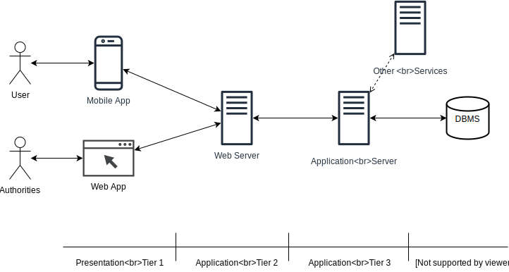

# Architectural Description

## Overview
The product is a distributed application based on the three logic layers of Presentation, that manages the user's interaction with the system, Application, which handles the logic of the system and Data, which manages the information. 

Those three layers are divided onto four different physical tiers. As shown by the following image, Presentation and Data levels reside on a single tier, while Application level is split into two tiers. The first one is the Web Server, 
responsible for the forwarding of requests from the clients and for the caching of static contents, while the second one is the Application Server, which contains the logic of the system. 

 

In order to maximize the scalability of our system, both the Web and Application server follow a scale-out approach: performances improvement is obtained through nodes replication. 
Because of this approach, load-balancing system are used in order to distribute the working load among the various nodes. 
All the nodes of the Application Server use a "share everything" configuration, because there is only one shared database with one point of access. 
Moreover, the Data layer is accomplished by exploiting and external DBMS service already available on the market. In this way we avoid devoting time on difficult
problems about data replication and consistency, which are already solved by the existing and well tested database systems. 

Every communication channel is secured by using firewalls. In this way, the entire Application layer is secured in a DMZ, so attacks and intrusions from malicious 
clients will be prevented. It is important to note that, because the DBMS is located on a different tier with respect to the Application Server, a firewall between them 
can improve the security of the system against malicious attacks coming from the data base, especially in the case of an external DBSM like in our solution. 
Finally, both communication channels between the Application server and other services, like the Ticket service, are secured for the 
same reasons explained above.

## Component view
 
The Component view diagrams represents, explicitly, only the components of the Application server, as they depict the main section of the system. 
Below we will describe in depth the function of every internal server component made ad-hoc for the system (the ones in green).
* **Router**: receives HTTP over SSL/TLS requests following the REST paradigm (see below in the "Component interface" section for further details) and forward them to the others internal components of the Application server. Then forwards the replies
back to the clients. It is relevant to note that temporary tokens are adopted, in order to define which functionalities are accessible for each client. Every client receives its personal token after the login procedure. 
* **UserManager**:
    * **LoginManager**: this component is responsible for granting access to registered users. In particular, the component receives the access credentials and returns an unique token used for further communication
    by the user.
    * **SignUpManager**: this component is responsible for the registration of unregistered users. In particular it receives the new access credentials and save them in the system's database. 
* **ReportManager**:
    * **ReportReceiver**: this component is responsible for receiving the data of new reports and storing them in the database. In particular it takes care of the following tasks:
        * employ the MS apis to retrieve the information about which municipality the report has been created from.
        * recognizing the car's plate in the picture, by employing the OCRS apis. In case of an unrecognizable plate, the report status will be set to "NOTVALID" by default, otherwise it will be "NOTVERIFIED" (which means that a local officer has still to prove its validity).
        * saving the report in the system's database.
    * **ReportValidator**: this component is responsible for two main operations:
        * fetching, from the database, of reports with status set to "NOTVERIFIED".
        * modification of status of a set of report, by changing if from "NOTVERIFIED" to "VALID" or "NOTVALID" according to the request sent by the local officer. Then it saves them in the database and sends them to the TS, responsible for issuing traffic tickets.
* **ReportMiner**: this component is responsible for obtaining reports by querying the database. It is crucial to note that the request of the authority can come from directly from the Router of from other components like the ImprovementsManager and StatisticsComputationManager. In both cases, authority's municipality is used for filtering reports. Only reports with status set to "VALID" are fetched. Various form of mining can be performed, in particular it's is possible to mine:
    * All: all the reports produced in the same municipality of the authority, who has issued the request, are returned.
    * By Type: between all the reports produced in the same municipality of the authority, who has issued the request, only those which have the given violation's type are returned.
    * By Date: between all the reports produced in the same municipality of the authority, who has issued the request, only those which were composed on the given date are returned.
    * By Time: between all the reports produced in the same municipality of the authority, who has issued the request, only those which were composed on the given time, regardless the date, are returned.
    * By Area: between all the reports produced in the same municipality of the authority, who has issued the request, only those which were composed in the given area, defined by a center and a radius, are returned.
    
* **ImprovementManager**: this component is responsible for getting the possible improvements belonging to the requesting authority's municipality and for setting their status. In order to determine the possible improvements, it crosses the data
coming from the external MAS and from the MineReports component. When a new improvement is determined, it's status is set by default to "NOTDONE" and it is saved in the database. When no further improvements can be discovered, all those which have the status set to "NOTDONE" 
are returned to the requester. Moreover, through this component, an authority can set the status of a specific improvement to "DONE", after fetching all the possible one as described before.  
* **StatisticsComputationManager**: this component is responsible for building statistics, belonging to the requesting authority's municipality, about the violations and the 
perpetrators who cause them by crossing the information coming from reports received by the ReportMiner and from issued tickets coming from the TS. 
It is important to note that statistics are always crunched on request and never saved on the server, because they can change at any time. 
* **StatisticsDownloadManager**: this component is responsible for creating a non materialized document (which means it is not saved on server side, but only generated
and sent) about the statistics, belonging to the requesting authority's municipality, 
by fetching them from the StatisticsComputationManager. The resulting document is returned to the caller.
## Deployment view
 

This picture shows how the system should be deployed: 
* It is available for end users as a Mobile application, while, for authorities, as a Web application, accessible both from Mobile and PC.
* The Web server, deployed on its physical node, has the purpose of caching static contents (which are, for example, .html and .css files) for the Web application. 
Every other request received from the clients (both the Web and Mobile application) is automatically forwarded to the Application server. 
* The Application server and the Database server are deployed on two different physical nodes, in order to have more security for data and to achieve a decoupled architecture. 
Other external services has been ignored for this view.

## Runtime view

## Component interfaces

### Web server interface and Report interface

For the Web server interface and the Report interface a RESTful api has been chosen. Since both interfaces are a vital part of the system, and the components that they connect belongs to the part that will be implemented, they will be discussed in depth.

#### REST table of resources

The following table represents the logic structures of the resources of the system and the operation that can be done on them.

| URI | POST | GET | PUT | DELETE |
| ---- | ---- | ---- | ---- | ---- |
| /users/registration/?id=xxx| X | - | - | - |
| /users/login/?id=xxx | - | X | - | - |
| /users/authorities/login/?id=xxx| - | X | - | - |
| /reports/default | X | - | - | - |
| /reports/default/?id=xxx| - | X | - | - |
| /reports/default/unsafearea | - | X | - | - |
| /reports/notverified/?id=xxx | - | X | X | - |
| /reports/valid/?id=xxx | - | X | - | - | 
| /improvements/?id=xxx | - | X | X | - |
| /statistics/?id=xxx | - | X | - | - |

"X" : the operation is applicable on the resource
 
"-" : the operation is inapplicable on the resource

Here a quick description of the resources group:
* */users/** represents the information related to the users, in particular their account information 
* */reports/default/** represents the resources accessible by the RU, in particular reports and "pseudo report" for the unsafe areas. These resources will be greatly used by the mobile app.
* */reports/notverified/** contains all the received reports that haven't been immediately discarded by the OCR but are still on impending evaluation by a LO 
* */reports/valid/** contains all the received reports that have been judged as valid by a LO
* */improvements/** contains the improvements suggested to a municipality that can be retrieved by a ME
* */statistics/** contains the statistics that can be retrieved by a ME

#### General request description 

The data that will be transmitted will be composed of XML files.

To recognize the user who sent a request to the server, the system will employ tokens. 
A token is a string that is provided to the user as an answer to the login, it contains information on the user and will always be part of the requests, except the login and sign up.
The contained information will be:

* User type information: the different type users (RU, LO and ME) will be identified in different ways to avoid ambiguity. Moreover the identifier for LO and ME will contain an identifier for the Municipality they work for
* User identifier: The single user will be identified to have information on who is making the request and give the correct permission to access data.
* Creation time: The token is a "one time only" use. Its validity is fixed and will generally last at least for a session, this permits to recycle pieces of tokens and avoids the malicious use of old ones to get data.

The tokens will be structured in a way that will be impossible to decipher by malevolent parties and that will guarantee legitimacy for each request.

#### Detailed requests

**POST**   &nbsp;&nbsp;&nbsp;&nbsp;/users/registration/?id={id}

This request is used to register a user.

**Parameters**

| Field | Type | Description |
| ---- | ---- | ---- |
|  id | String | The username of the user who is trying to register |

**Fields**

| Field | Type | Description |
| ---- | ---- | ---- |
| email | String | The email of the user |
| passwordFirst | String | The password of the user |
| passwordSecond | String | The same password as before, used to confirm the first password |

**Success 201** (resource created)

**Error 401** (Unauthorized)

| Field |  Description |
| ---- |  ---- |
| ExistingUsername | Someone with the same username is already registered | 
| DifferentPassword | The second password is different from the first one |
| ExistingMail | This email is already associated with another account |

------------------------------------------------------------------------------------------------------------------------------------

**GET**   &nbsp;&nbsp;&nbsp;&nbsp;/users/login/?id={id}

This request allows a RU to login. 

**Parameters**

| Field | Type | Description |
| ---- | ---- | ---- |
|  id | String | The username of the user who is trying to login |

**Fields**

| Field | Type | Description |
| ---- | ---- | ---- |
| loginInformation | String | The email or username of the user |
| password | String | The password of the user |

**Success 200** (request OK)

| Field | Type | Description |
| ---- | ---- | ---- |
| token | String | A token that represents the user |
| reportIDs | String[] | The list of id associated with the reports uploaded by the user |

**Error 401** (Unauthorized)

| Field |  Description |
| ---- |  ---- |
| WrongUsernameOrPassword | The written username and password does not correspond to any existing user | 

------------------------------------------------------------------------------------------------------------------------------------

**GET**   &nbsp;&nbsp;&nbsp;&nbsp;/users/authorities/login/?id={id}

This request allows a ME or LO to login. 

**Parameters**

| Field | Type | Description |
| ---- | ---- | ---- |
|  id | String | The username of the user who is trying to login |

**Fields**

| Field | Type | Description |
| ---- | ---- | ---- |
| loginInformation | String | The username of the user |
| password | String | The password of the user |
| workRole | String | This will be 'ME' or 'LO' |

**Success 200** (request OK)

| Field | Type | Description |
| ---- | ---- | ---- |
| token | String | A token that represents the user and the municipality he/she works in|
| municipalityID| String | The id of the municipality where the ME or LO works, this will be a parameter for the following requests |

**Error 401** (Unauthorized)

| Field |  Description |
| ---- |  ---- |
| WrongUsernameOrPassword | The written username and password does not correspond to any existing user | 
| NotCorrespondingRole | The selected work role does not correspond to the user which given login and password corresponds to | 

------------------------------------------------------------------------------------------------------------------------------------

**POST**   &nbsp;&nbsp;&nbsp;&nbsp;/reports/default

This request adds a report to the system.

**Fields**

| Field | Type | Description |
| ---- | ---- | ---- |
| vehicle | Object | The vehicle information |
| &nbsp;&nbsp;&nbsp;&nbsp;licensePlate | String | The license plate of the vehicle |
| position | Object | The position, expressed in DMS, of the vehicle when the report was submitted  |
| &nbsp;&nbsp;&nbsp;&nbsp;latitude | String | The latitude where the vehicle was recorded to be |
| &nbsp;&nbsp;&nbsp;&nbsp;longitude | String | The longitude where the vehicle was recorded to be |
| picture | Object | Representation of the image of the vehicle |
| violation | Object[] | An array of the type of violation |
| &nbsp;&nbsp;&nbsp;&nbsp;violationType | String | The type of violation |
| date | String | The datetime in dd-MM-yyyyThh:mm:ss format |

**Success 201** (resource created)

| Field | Type | Description |
| ---- | ---- | ---- |
| id | String | The id that the system has assigned to the sent report, this id will uniquely identify the report and will also contain information about the user which sent it |

------------------------------------------------------------------------------------------------------------------------------------

**GET**   &nbsp;&nbsp;&nbsp;&nbsp;/reports/default/?id={id}

This request retrieves a report form the system.

**Parameters**

| Field | Type | Description |
| ---- | ---- | ---- |
| id | String | The id that uniquely identifies the report that the user wants to see|

**Success 200** (request OK)

| Field | Type | Description |
| ---- | ---- | ---- |
| vehicle | Object | The vehicle information |
| &nbsp;&nbsp;&nbsp;&nbsp;licensePlate | String | The license plate of the vehicle |
| position | Object | The position, expressed in DMS, of the vehicle when the report was submitted  |
| &nbsp;&nbsp;&nbsp;&nbsp;latitude | String | The latitude where the vehicle was recorded to be |
| &nbsp;&nbsp;&nbsp;&nbsp;longitude | String | The longitude where the vehicle was recorded to be |
| picture | Object | Representation of the image of the vehicle |
| violation | Object[] | An array of the type of violation |
| &nbsp;&nbsp;&nbsp;&nbsp;violationType | String | The type of violation |
| date | String | The datetime in dd-MM-yyyyThh:mm:ss format |

**Error 403** (forbidden)

| Field | Description |
| ---- | ---- |
| UserNotAuthorized | The id of the report and the token of the user have been analyzed. It was found that the user was not the one who submitted the report and as such the RU was not permitted to see the report  |

------------------------------------------------------------------------------------------------------------------------------------

**GET**   &nbsp;&nbsp;&nbsp;&nbsp;/reports/default/unsafearea

This request retrieves the type of violations in certain area.

**Fields**

| Field | Type | Description |
| ---- | ---- | ---- |
| position | Object | The position, expressed in DMS, of the center of the area which the RU wants to know about |
| &nbsp;&nbsp;&nbsp;&nbsp;latitude | String | The latitude where the vehicle was recorded to be |
| &nbsp;&nbsp;&nbsp;&nbsp;longitude | String | The longitude where the vehicle was recorded to be |

**Success 200** (request OK)

| Field | Type | Description |
| ---- | ---- | ---- |
| pseudoReport | Object[] | The list of partial reports that can be seen bya a RU |
| &nbsp;&nbsp;&nbsp;&nbsp;position | Object | The position, expressed in DMS, of the vehicle when the report was submitted  |
| &nbsp;&nbsp;&nbsp;&nbsp;&nbsp;&nbsp;&nbsp;&nbsp;latitude | String | The latitude where the vehicle was recorded to be |
| &nbsp;&nbsp;&nbsp;&nbsp;&nbsp;&nbsp;&nbsp;&nbsp;longitude | String | The longitude where the vehicle was recorded to be |
| &nbsp;&nbsp;&nbsp;&nbsp;violation | Object[] | An array of the type of violation |
| &nbsp;&nbsp;&nbsp;&nbsp;&nbsp;&nbsp;&nbsp;&nbsp;violationType | String | The type of violation |

------------------------------------------------------------------------------------------------------------------------------------

**GET**   &nbsp;&nbsp;&nbsp;&nbsp;/reports/notverified/?id={id}

This request retrieves the reports that are waiting for validation in a certain municipality.

**Parameters**

| Field | Type | Description |
| ---- | ---- | ---- |
| id | String | The id that uniquely identifies the municipality which the LO works for |

**Success 200** (request OK)

| Field | Type | Description |
| ---- | ---- | ---- |
| reports | Object[] | A list of the valid reports of a certain municipality |
| &nbsp;&nbsp;&nbsp;&nbsp;vehicle | Object | The vehicle information |
| &nbsp;&nbsp;&nbsp;&nbsp;&nbsp;&nbsp;&nbsp;&nbsp;licensePlate | String | The license plate of the vehicle |
| &nbsp;&nbsp;&nbsp;&nbsp;position | Object | The position, expressed in DMS, of the vehicle when the report was submitted  |
| &nbsp;&nbsp;&nbsp;&nbsp;&nbsp;&nbsp;&nbsp;&nbsp;latitude | String | The latitude where the vehicle was recorded to be |
| &nbsp;&nbsp;&nbsp;&nbsp;&nbsp;&nbsp;&nbsp;&nbsp;longitude | String | The longitude where the vehicle was recorded to be |
| &nbsp;&nbsp;&nbsp;&nbsp;picture | Object | Representation of the image of the vehicle |
| &nbsp;&nbsp;&nbsp;&nbsp;violation | Object[] | An array of the type of violation |
| &nbsp;&nbsp;&nbsp;&nbsp;&nbsp;&nbsp;&nbsp;&nbsp;violationType | String | The type of violation |
| &nbsp;&nbsp;&nbsp;&nbsp;date | String | The datetime in dd-MM-yyyyThh:mm:ss format |

**Error 403** (forbidden)

| Field | Description |
| ---- | ---- |
| UserNotAuthorized | The id of the municipality and the token of the user have been analyzed. It was found that the user was not an LO or the LO's municipality was not the one of the reports requested|

--------------------------------------------------------------------------------------------------------------------------------------

**PUT**   &nbsp;&nbsp;&nbsp;&nbsp;/reports/notverified/?id={id}

This request modifies the status of a report. 

**Parameters**

| Field | Type | Description |
| ---- | ---- | ---- |
| id | String | The id that uniquely identifies the municipality which the LO works for |

**Fields**

| Field | Type | Description |
| ---- | ---- | ---- |
| id | String | The id of the report |
| newStatus | String | The result of the validation performed by the LO |

**Error 403** (forbidden)

| Field | Description |
| ---- | ---- |
| UserNotAuthorized | The id of the municipality and the token of the user have been analyzed. It was found that the user was not an LO or the LO's municipality was not the one of the reports requested |

----------------------------------------------------------------------------------------------------------------------------------------
**GET**   &nbsp;&nbsp;&nbsp;&nbsp;/reports/valid/?id={id}

This request gets all the valid reports in a certain municipality.

**Parameters**

| Field | Type | Description |
| ---- | ---- | ---- |
| id | String | The id that uniquely identifies the municipality which the LO works for |

**Fields**

| Field | Type | Description |
| ---- | ---- | ---- |
| id | String | The id of the report |
| requestType | String | The type of request issued (i.e. "by area") |
| requestField| String | The field that contains precise information on the request |

**Success 200** (request OK)

| Field | Type | Description |
| ---- | ---- | ---- |
| reports | Object[] | A list of the valid reports of a certain municipality |
| &nbsp;&nbsp;&nbsp;&nbsp;vehicle | Object | The vehicle information |
| &nbsp;&nbsp;&nbsp;&nbsp;&nbsp;&nbsp;&nbsp;&nbsp;licensePlate | String | The license plate of the vehicle |
| &nbsp;&nbsp;&nbsp;&nbsp;position | Object | The position, expressed in DMS, of the vehicle when the report was submitted  |
| &nbsp;&nbsp;&nbsp;&nbsp;&nbsp;&nbsp;&nbsp;&nbsp;latitude | String | The latitude where the vehicle was recorded to be |
| &nbsp;&nbsp;&nbsp;&nbsp;&nbsp;&nbsp;&nbsp;&nbsp;longitude | String | The longitude where the vehicle was recorded to be |
| &nbsp;&nbsp;&nbsp;&nbsp;picture | Object | Representation of the image of the vehicle |
| &nbsp;&nbsp;&nbsp;&nbsp;violation | Object[] | An array of the type of violation |
| &nbsp;&nbsp;&nbsp;&nbsp;&nbsp;&nbsp;&nbsp;&nbsp;violationType | String | The type of violation |
| &nbsp;&nbsp;&nbsp;&nbsp;date | String | The datetime in dd-MM-yyyyThh:mm:ss format |

**Error 403** (forbidden)

| Field | Description |
| ---- | ---- |
| UserNotAuthorized | The id of the municipality and the token of the user have been analyzed. It was found that the user was not an LO or the LO's  municipality was not the one of the reports requested  |

----------------------------------------------------------------------------------------------------------------------------------------

**GET**   &nbsp;&nbsp;&nbsp;&nbsp;/improvements/?id={id}

This request retrieves all the suggested improvements in a certain municipality.

**Parameters**

| Field | Type | Description |
| ---- | ---- | ---- |
| id | String | The id that uniquely identifies the municipality which the ME works for |

**Success 200** (request OK)

| Field | Type | Description |
| ---- | ---- | ---- |
| improvements | Object[] | The list of suggested improvements |
| &nbsp;&nbsp;&nbsp;&nbsp;type | String | The of the improvement, i.e. "add a cycling lane" |
| &nbsp;&nbsp;&nbsp;&nbsp;position | Object | The position of the improvement expresses in DMS |
| &nbsp;&nbsp;&nbsp;&nbsp;&nbsp;&nbsp;&nbsp;&nbsp;latitude | String | The latitude where the suggested improvement will be expected to be |
| &nbsp;&nbsp;&nbsp;&nbsp;&nbsp;&nbsp;&nbsp;&nbsp;longitude | String |The longitude where the suggested improvement will be expected to be  |
| &nbsp;&nbsp;&nbsp;&nbsp;state | String | The status of the improvement, it could be "DONE" or "NOT DONE" |

**Error 403** (forbidden)

| Field | Description |
| ---- | ---- |
| UserNotAuthorized | The id of the municipality and the token of the user have been analyzed. It was found that the user was not an ME or the ME's  municipality was not the one of the reports requested  |

----------------------------------------------------------------------------------------------------------------------------------------

**PUT**   &nbsp;&nbsp;&nbsp;&nbsp;/improvements/?id={id}

This request modifies the status of an improvement from "not done" to "done".

**Parameters**

| Field | Type | Description |
| ---- | ---- | ---- |
| id | String | The id that uniquely identifies the municipality which the LO works for |

**Fields**

| Field | Type | Description |
| ---- | ---- | ---- |
| id | String | The id of the improvement |

**Error 403** (forbidden)

| Field | Description |
| ---- | ---- |
| UserNotAuthorized | The id of the municipality and the token of the user have been analyzed. It was found that the user was not an ME or the ME's municipality was not the one of the reports requested |

----------------------------------------------------------------------------------------------------------------------------------------

**GET**  &nbsp;&nbsp;&nbsp;&nbsp; /statistics/?id={id}

This  request gets the available statistics on a certain municipality.

**Parameters**

| Field | Type | Description |
| ---- | ---- | ---- |
| id | String | The id that uniquely identifies the municipality which the LO works for |

**Success 200** (request OK)

| Field | Type | Description |
| ---- | ---- | ---- |
| statistics | Object[] | The various statistics |
|&nbsp;&nbsp;&nbsp;&nbsp; firstFieldName | String | The name of the first field of the graph |
|&nbsp;&nbsp;&nbsp;&nbsp; secondFieldName | String | The name of the second field of the graph |
|&nbsp;&nbsp;&nbsp;&nbsp; firstFieldValues | Number[] | The values of the first field |
|&nbsp;&nbsp;&nbsp;&nbsp; secondFieldValues | Number[] | The value of the second field |

**Error 403** (forbidden)

| Field | Description |
| ---- | ---- |
| UserNotAuthorized | The id of the municipality and the token of the user have been analyzed. It was found that the user was not an ME or the ME's  municipality was not the one of the reports requested  |

### TS interface and MAS interface

Since both the TS and the MAS are optional external services which are not completely specified on the outer part of the system, we will assume that the communication interface will be provided trough RESTful api
given the fact that a stateless communication will ease the load on both our system and the Municipality's system.

Here the structure of what will be expected to be exchanged between our system and the municipality's ones:

#### Request of data about accidents

| Field | Type | Description |
| ---- | ---- | ---- |
| statistics | Object[] | The various statistics |

#### Request of data about tickets

| Field | Type | Description |
| ---- | ---- | ---- |
| statistics | Object[] | The various statistics |

#### Forwarding of data about valid reports

| Field | Type | Description |
| ---- | ---- | ---- |
| statistics | Object[] | The various statistics |

### DBMS interface

(va specificato da qualche parte che il DB userà quello detto da Monica)

The communication between the database and our system will be handled by a class

uso del DB

-creazione nuova tabella
- inserimento di nuovi report
- ricerca di report non validati
- modifica di report non validati con la sostituzione a report validi
- ricerca di report validi  

### Map interface 

 

## Selected architectural styles and patterns
 xml yadiyada
## Other design decisions
security yadiyada

? add id on improvements, reports, municipality