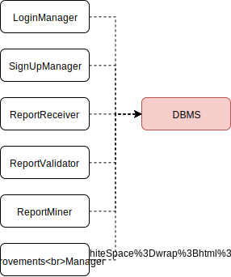
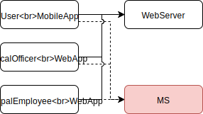

# Implementation, Integration and Test Plan
The system is composed by various subsystems, some of which need to be implemented and tested. 

* To be implemented and tested:
    * UserMobileApp
    * LocalOfficerWebApp
    * MunicipalEmployeeWebApp
    * WebServer
    * ApplicationServer
* Already implemented and tested:
    * DBMS
    * OCRS
    * MS
    * TS
    * MAS
    
The approach followed is a "bottom-up" one, where all the interfaces are defined a priori, in order to develop non-implemented components in parallel and test them. Moreover, implementation and integration follow the same order, such a way that the system will be ready and functional as soon as possible. 
It is worth noting that external components already implemented do not need to be tested. 

The following table specifies the main features of the system, their importance for the customer and their 
difficulty of implementation. 
   

| Feature | Importance for the customer | Difficulty of implementation |
| ---- | ---- | ---- |
| SignUp and Login | Low | Low |
| Add a report for RU | High | Medium |
| Retrieve reports for RU | High | Low |
| Get unsafe areas for RU | Medium | Low |
| Mine reports for ME/LO | High | Medium |
| See statistics for ME/LO | Medium | Medium |
| Download statistics for ME/LO | Medium | Low |
| Validate reports for LO | High | Low |
| Get improvements for ME | High | High |
| Functional mobile app for RU | High | Medium 
| Functional web app for LO | High | Medium | 
| Functional web app for ME | High | Medium | 

The order of implementation and testing of missing components is based on the previous table, starting from components associated to more difficult and crucial features. 
The following table specifies the order of implementation and testing, associating components to relative features. 
It is important to note that, components enlisted in the same "Phase of I&T" have to be developed in parallel. 

| Phase of I&T | Component | Features |
| ---- | ---- | ---- |
| 1 | ReportReceiver | Add a report for RU |
| 1 | ReportMiner | Retrieve reports for RU, Mine reports for ME/LO, Get unsafe areas for RU |
| 2 | ReportValidator | Validate reports for LO |
| 2 | ImprovementsManager | Get improvements for ME |
| 2 | StatisticsComputationManager | See statistics for ME/LO |
| 3 | StatisticsDownloadManager | Download statistics for ME/LO |
| 4 | Router | No specific user feature | 
| 4 | SignUpManager | SignUp and Login |
| 4 | LoginManager | SignUp and Login |
| 5 | WebServer | No specific user feature | 
| 5 | UserMobileApp | Functional mobile app for RU |
| 5 | LocalOfficerWebApp | Functional web app for LO | 
| 5 | MunicipalEmployeeWebApp | Functional web app for ME|

In particular here is described how the previous features are obtained through the system's components:
* **SignUp and Login**: this feature is realized through the following components:
    * SignUpManager: responsible for registering new users;
    * LoginManager: responsible for recognizing registered users and authorities.
* **Add a report for RU**: this feature is realized through the component *ReportReceiver*, which receives the report, submits it to the *OCRS*, in order to get its validity status and the eventual vehicle plate, and saves it in the database through the *DBMS*.
* **Retrieve reports for RU**: this feature is realized through the component *ReportMiner*, which receives the request, coming from the *Router*, asks the database through the *DBMS* and returns the all the reports composed by the requesting user. 
* **Get unsafe area for RU**: this feature is realized through the component *ReportMiner*, which receives the request, coming from the *Router*, asks the database through the *DBMS* and returns violations type, date and time of valid reports issued in the requested area. 
* **Mine reports for ME/LO**: this feature is realized through the component *ReportMiner*, which receives the request, coming from the *Router*, asks the database through the *DBMS* and returns the valid reports issued in the authority's municipality that satisfy the requested condition (All, Date, Time, Violation Type, Area).
* **See statistics for ME/LO**: this feature is realized through the component *StatisticsComputationManager*, which receives the request coming from the *Router*, asks the database through the *DBMS* for valid reports and retrieves data about issued tickets through the *TS*, crosses them, produces and returns statistics to the requesting authority. 
* **Download statistics for ME/LO**: this feature is realized through the component *StatisticsDownloadManager*, which asks *StatisticsComputationManager* for statistics, generate a non materialized document and returns it to the requesting authority. 
* **Validate reports for LO**: this feature is realized through the component *ReportValidator*, which is able to retrieve not verified reports belonging to the LO's municipality from the database through the *DBMS* and let the LO setting their validity. 
* **Get improvements for ME**: this feature is realized through the component *ImprovementsManager*, which is able to get valid reports, issued in the ME's municipality, from the database through the *DBMS* and cross their data with the information coming from the *MAS*, in order to generate new possible improvements. Then they are presented to the ME, along with previously generated improvements, saved in the database, still not completed. Finally the ME can set the status of the improvements received. 
* **Functional mobile app for RU**: this feature is realized through the implementation, testing and integration of the *UserMobileApp*;
* **Functional web app for LO**: this feature is realized through the implementation, testing and integration of the *LocalOfficerWebApp*;
* **Functional web app for ME**: this feature is realized through the implementation, testing and integration of the *MunicipalEmployeeWebApp*;

It is crucial to note that, for each feature, all the described components have to be integrated and unit tested. 

The integration is driven by the following diagrams, which describes the dependencies between all the components of the system. 
The arrow relation from a component A to a component B indicate that A "uses" B. So, in order to integrate and unit test component A, component B must be already integrated and unit tested. Finally, components that are not used by no other components do not need to be
integrated and unit tested (in our case the components highlighted in red, which are the already implemented ones, are be the starting points for the integration and unit testing).

* ReportReceiverIntegration

 

* DatabaseAccessorsIntegration

 

* TicketServiceAccessorsIntegration

 

* ImprovementManagerIntegration

 

* ReportMinerAccessorsIntegration

 

* StatisticsDownloadManagerIntegration

 

* RouterIntegration

 

* WebServerIntegration

 

* AppsIntegration

 

