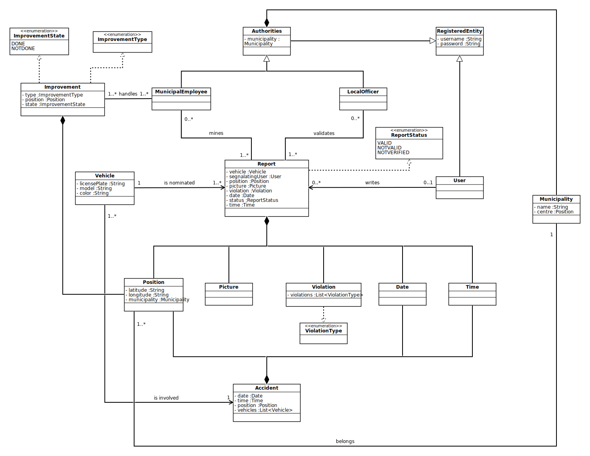

# Overall Description
## Product perspective
The product will be developed from scratch and will be organized in two different macro-entities, one dedicated to the normal user, the other dedicated to the authorities, that may be MEs or LOs (for more information on the users see section 2.3). 
The two parts will be differentiated to satisfy different needs of different parties that will employ SafeStreets. Their form, along with the one of some other parts of the system, is represented with the following high level class diagram. 

### Class diagram

### State diagrams

Some of the entities of the class diagram evolve, assuming different states, while the system is being used. The following diagrams show those states that will be found.

#### User state diagram, assumed by all users (authorities and normal users). 

This diagram does not have an end state because, once a user has been correctly registered in the system, its presence in the system will ideally never disappear.

#### Report construction state diagram. 

This diagram contains all the states that the system will assume while a user creates a report. Not all of the transitions are caused by the user, in fact in the "Impending GPS localization" state the system will independently retrieve the location, is possible also to notice that in this state, unlike all the others, both the abort and go back transitions are missing.
Thanks to the domain assumptions (see paragraph 2.4) the system will never be stuck on the "Impending GPS localization" state, giving only to the user the choice of reaching one of the two final states.

#### Report state diagram (also see section 2.2.1)

This diagram represents the state of a report from when it is received by the system to the evaluation of a LO. When a report arrives to the system, the license plate, that has been already highlighted by the user, will be run through the OCRS, if the plate is regarded as illegible the report will be automatically regarded as not valid, otherwise the choice of the final state of the report will be taken by the LO.  

#### Improvement state diagram (also see section 2.2.2)

This diagram contains the states of an improvement from when is framed to when it is completed. Is possible that some of the improvements will never be completed, remaining forever in the not done state, but if one is indeed finished, and set as done by a ME, it will be discarded and never shown again (only on the street where it was proposed).  

### World and Phenomena

| Phenomenon | Shared | Who Controls It |
| ---- | ---- | ---- |
| UU inserts its credentials | Y | W |
| S2B checks UU credentials | N | M |
| RU/ME/LO logs in | Y | W |
| S2B checks RU/ME/LO credentials | N | M |
| RU wants to add a report | N | W |
| RU takes a picture of the violation | Y | W |
| RU choose the type of violations | Y | W |
| RU sends a report | Y | W |
| S2B registers a report | N | M |
| RU wants to request its reports | N | W |
| RU requests its reports | Y | W |
| RU asks the S2B for seeing reports by area | Y | W |
| S2B selects the reports for the RU | N | M |
| S2B provides RU with requested reports | N | M |
| ME/LO wants to mine reports | N | W |
| ME/LO chooses the way of mining reports | Y | W |
| ME/LO asks the S2B for the mining | Y | W |
| S2B selects the reports for the ME/LO | N | M |
| S2B provides ME/LO with requested reports | Y | M |
| ME/LO wants to retrieve statistics | N | W |
| ME/LO asks the S2B for statistics | Y | W |
| S2B crunches statistics for the ME/LO | N | M |
| S2B provides ME/LO with statistics | Y | M |
| ME wants go get the possible improvements | N | W |
| ME asks the S2B for possible improvements | Y | W |
| S2B finds possible improvements for the ME's municipality | N | M |
| S2B provides ME with the possible improvements | Y | M |
| ME marks an improvement as done or not done | Y | W |
| S2B changes the status of the improvement as done or not note | N | M |
| LO wants to validate one or more reports | N | W |
| LO asks the S2B for validating reports | Y | W |
| S2B provides LO with the reports the reports to be verified | Y | M |
| LO marks a report as valid or not valid | Y | W |
| S2B changes the status of the report as valid or not valid | N | M |

 
 
 
## Product functions
In this section the most important functions of the system are reported.
### Report
The core of the system revolves around the management of the reports. Reports, that are structures that contains information about a violation, are created and then saved in the system with an "add" function. 
The "add" function builds the report, assembling the picture of the car that has committed a violation, with its license plate, date and time, GPS location, and violation type, sending it to SafeStreets at the end of the procedure.
When a report is received, the system checks if the license plate is readable, if not the report is discarded as "not valid", otherwise a set of possible operations becomes available. These operations are the "validate" and "mine"  functions.
The "validate" function shows every stored report, which status is set as "to be verified", with all the information listed above, and permits to change their status to "valid", if the report is considered legit, or "not valid", in the opposite case.
The "mine" functions finds the report type, of existing valid reports, searching in the system using type, date, time or area as parameters for the query. 

### Improvement
Using both data provided by the authorities and the data owned by SafeStreet is possible to identify the unsafe areas of a Municipality. 
Using the improvement function makes it possible to determine feasible solutions that can be used to improve the safety of such areas, i.e. add a barrier	
between	the bike lane and the part of the road for motorized vehicles to prevent unsafe parking.

### Statistics
With the information about issued tickets coming from the Ticket Service and SafeStreets' own data, is possible to build statistic about the violations and the perpetrators who cause them.
Some examples of these statistics can be seen in section 3.3.1 in the Local Officer paragraph. 
## User characteristics
There are three kind of users that will employ this product:

1. User: the normal, every day citizen that has subscribed to SafeStreets and recognized as RU. The RU is able to compile and send reports, see the chronology of his reports and search for violations in a selected area.
   Other functions will not be accessible by the user to protect privacy of other people, not necessary others RU, and to avoid providing excessive useless data to RU.   
    
2. Municipal Employee: the ME is someone hired from the municipality to which the task of accessing information,on behalf of the authorities, will be given. To such kind of individuals, a unique username and password will be provided, already linked to an account able to utilize all functions dedicated to the retrieval of data.
A ME is unable to add or modify the status of any reports, but is able to change the status of an improvement from "not done" to "done". 
    
3. Local Officer: The LO is part of the law enforcement of the municipality. As the ME, the LO receives his own account information from the municipality that will permit him/her to utilize all the functions to retrieve data.
    Unlike the ME, the LO is able to modify the state of a report but is unable to do so with an improvement. An LO may, or may not, utilize the data stored by SafeStreet to write tickets for the cars that committed a violation
   
## Assumptions, dependencies and constraints
To assure the correct formulations of the requirements, and avoid unforeseen events, a certain amount of the world phenomena is considered as follows.

* [D1] The number of possible violations is finite and is aligned to the current traffic rules
* [D2] The number of possible interventions is finite and there exists an already established correlation between violations and possible interventions
* [D3] When using the S2B, the user’s device is always connected to internet 
* [D4] When using the S2B, the user’s device has a valid GPS signal
* [D5] The internet connection works properly without failure
* [D6] The user device has a camera and is able to take pictures 
* [D7] The user does not fake his position 
* [D8] Every location has one and only one municipality
* [D9] Car plates are unique
* [D10] Each authority has its own account, certified and authorized by a state authority, and linked with the municipality which he/she works for 
* [D11] The official credentials of each municipal employee are different from those used for report violations (if he/she has registered as a normal user)
* [D12] The official credentials of each local officer are different from those used for report violations (if he/she has registered as a normal user)
* [D13] The state authority voids credentials of municipal employees or local officers at the end of their service
* [D14] When using the S2B, the authority's device is always connected to internet