# 3. Specific Requirements
## 3.1. External Interface Requirements
### 3.1.1. User Interfaces
The following mockups give an approximate idea of how the application’s interfaces should appear.
* Unregistered User
    * Sign-Up
    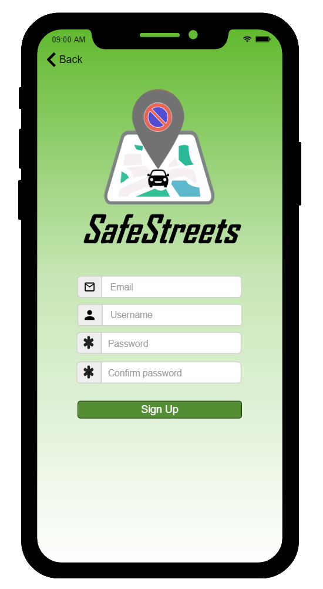
* Registered User
    * Log-In
    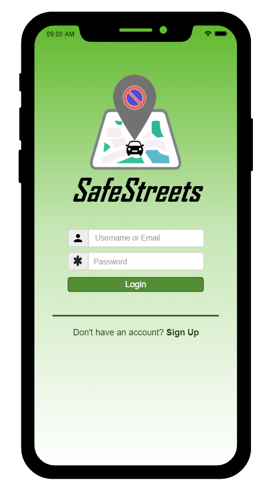
    * Get My Reports, all Reports
    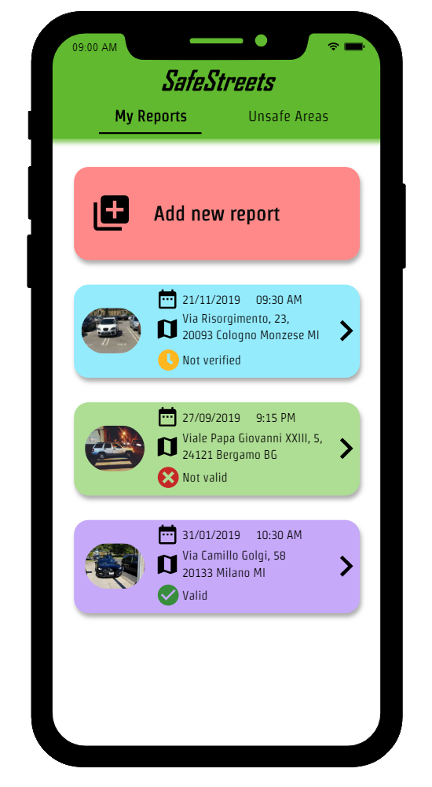
    * Get My Reports, information of a single report
    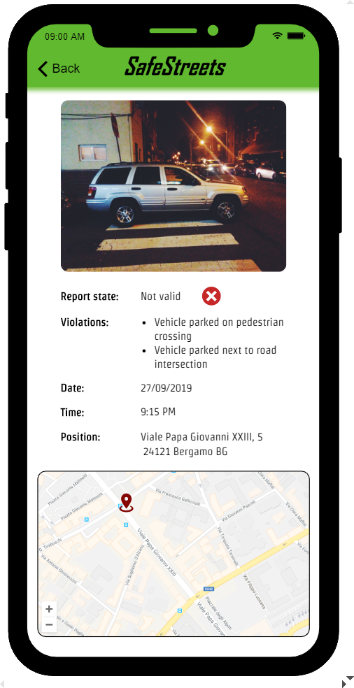
    * Get Unsafe Areas
    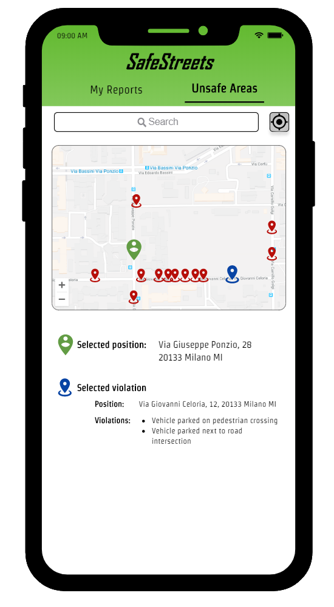
    * Add Report, taking photo from camera
    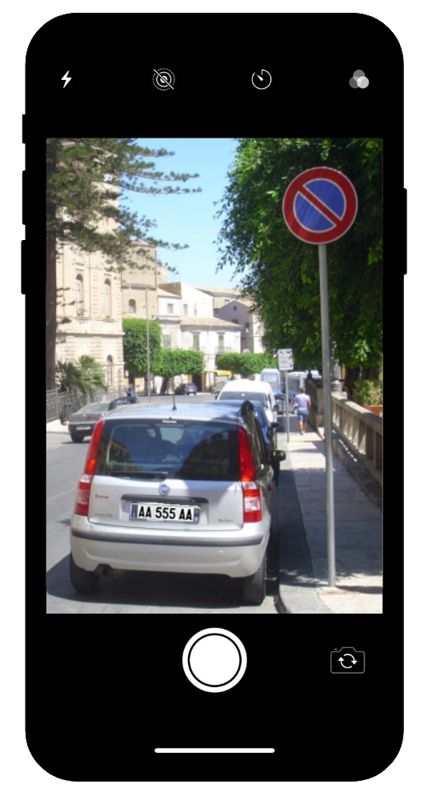
    * Add Report, confirmation of the taken photo
    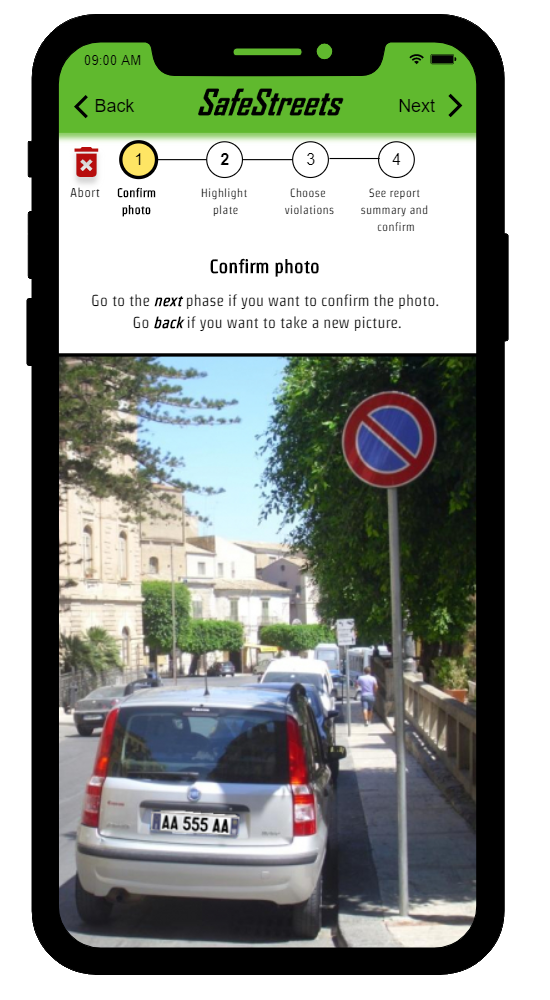
    * Add Report, highlighting of the car's plate
    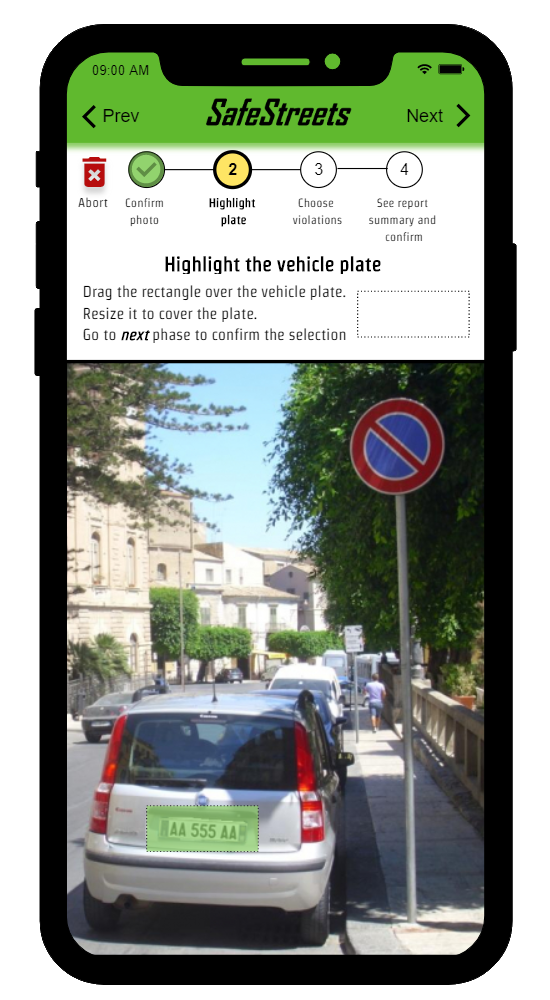
    * Add Report, choosing of the violation's types
    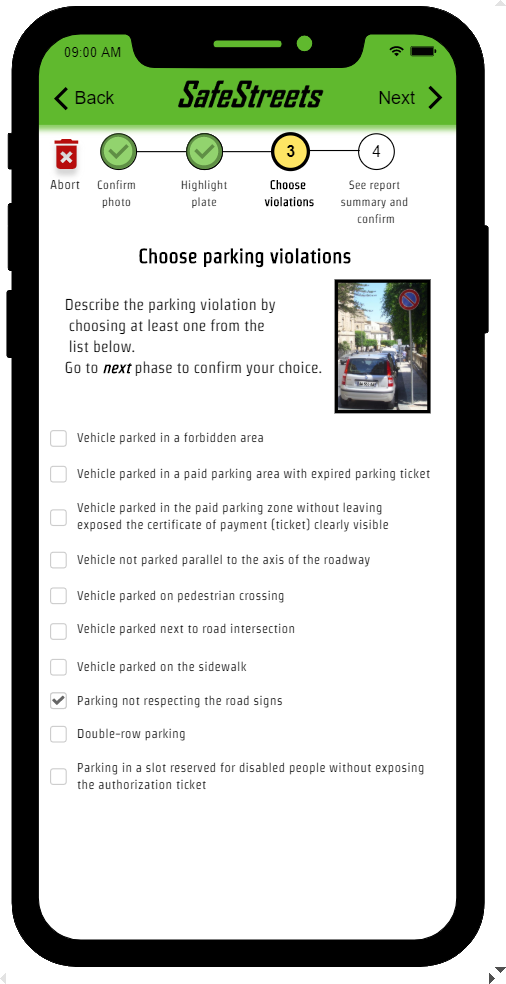
    * Add Report, confirmation
    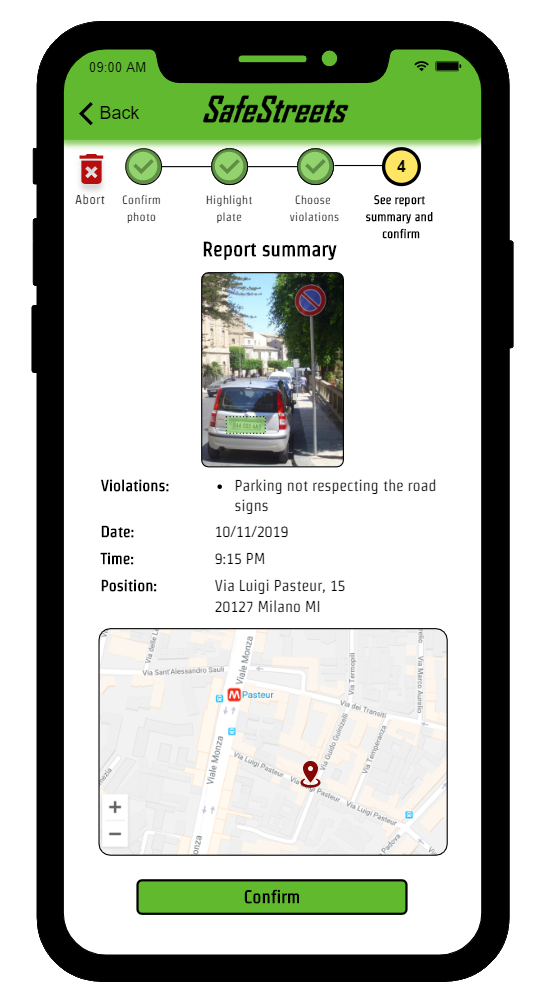
* Authority
    * Log-In
    
* Municipal Employee
    * See Statistics 
    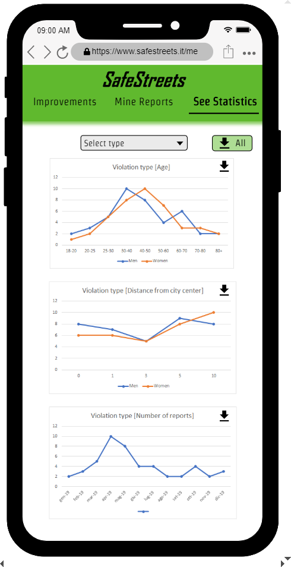
    * Get Improvements
    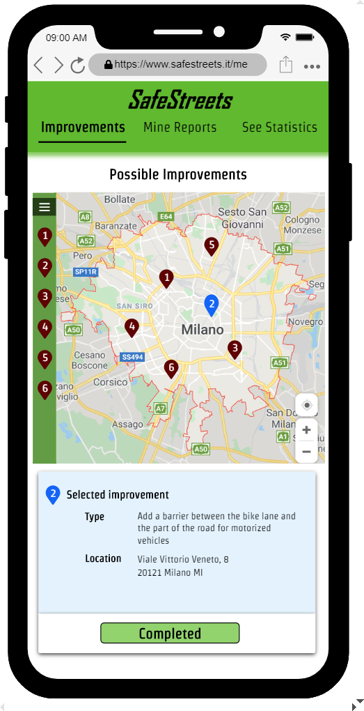
    * Mine Reports By *
    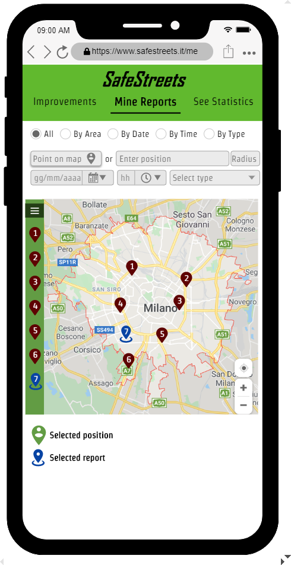
* Local Officer
    * See Statistics 
    
    * Validate Reports, compact view
    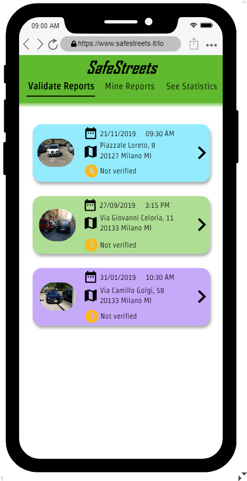
    * Validate Reports, expanded view
    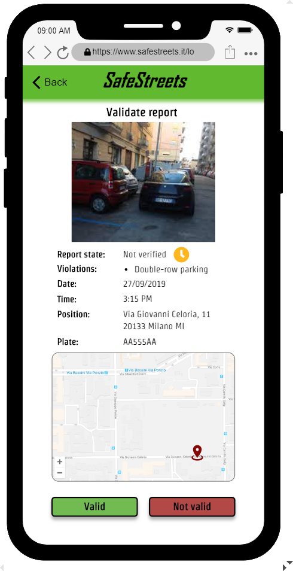
    * Mine Reports By *
    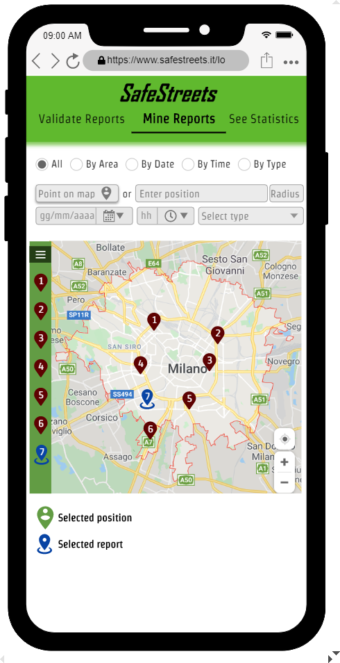
### 3.1.2. Hardware Interfaces
The system has no hardware interface.
### 3.1.3. Software Interfaces
The system does not offer any APIs to external applications for its usage.
### 3.1.4. Communication Interfaces
The system does not offer any APIs to external applications for communication.
## 3.2. Functional Requirements 
### 3.2.1. Scenarios
#### 3.2.1.1. Scenario 1
Cat has a disabled child. Tired from everybody that leave their car in the disable’s parking lot, Cat decides to download and install SafeStreets app. After subscribing to the service, she starts to take pictures of all the perpetrator’s cars. Sometime after, Cat notices that her reports are getting validated and along with that the number of times that she founds cars in the disabled parking lot start to diminish, that may be because the local police intervened and ticketed them. 
#### 3.2.1.2. Scenario 2 
Ned is looking for a house in the city, he has always lived in the countryside and  he’s scared of the possibility to live in areas with difficulty in finding car parks. He opens SafeStreets and using “Get Reports By Area” he can find the worst areas in the city and he can avoid them, looking for a house with confidence.
#### 3.2.1.3. Scenario 3
Jon has the reputation of not being a trustworthy guy. When he decides to use SafeStreets, Jon starts to report every car that he does not like, hoping that the owners of those car will receive a ticket. Luckily for the owners, those report won’t incur in any fine because the local police is able to validate the received reports and does not issue the cars in order, ignoring Jon’s report.
#### 3.2.1.4. Scenario 4 
Martha works as a municipal employee. The mayor asks her to make a list all possible investment to develop the streets of the city, in order to increase the street security.
Luckily for Martha, SafeStreets with its function "Get Improvements", highlights the most unsafe areas and suggests possible interventions. Reading these recommendations, Martha realizes that some of them have already been done so she diligently set them as completed with the “Notify Improvement”. Martha can now finish her assignment quickly and can dedicate more of her time to do nothing, she works for the municipality after all.
#### 3.2.1.5. Scenario 5 
The mayor, to promote his image before the next elections, wants to publish a report with the statistics regarding public security. With SafeStreets his secretary can easily retrieve such information, and prepare a detailed report with all the areas where public street security has improved during the mayor’s mandate.
#### 3.2.1.6. Scenario 6 
A group of citizens is concerned with the street security of their neighborhood but they don’t have much real data that can be used to support their concerns. They go to the municipality to ask for more information and possibly an interventions of the authorities. The municipality can quickly for search for data regarding their area and forward it higher authorities that will hopefully do something.
#### 3.2.1.7. Scenario 7 
A local officer in patrol is tasked to give fines during his work shift but usually this isn’t such an easy task. Normally he would spend a lot of time searching the usual street but, using SafeStreets, he can now retrieve reports about positions of parking violations using  “Mine Report” function. With these information the local officer starts the search. Luckily for him, he finds a lot of violations in the streets specified by SafeStreet, so he can proceed and charge the owners of those cars for their sins (violations).
### 3.2.2. Use Case Diagrams 
* Unregistered User

* Registered User
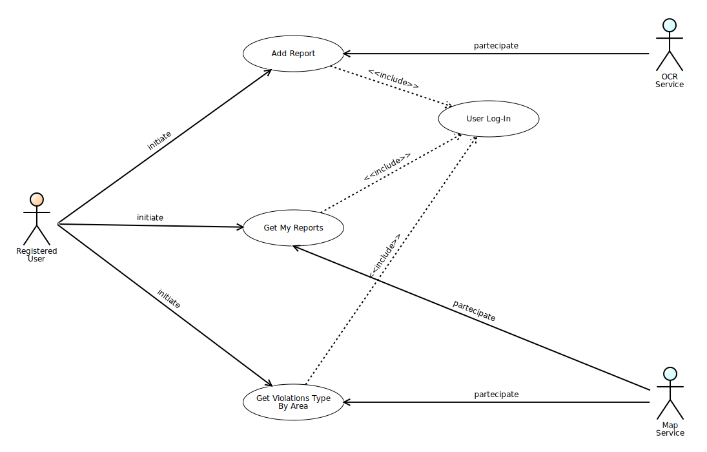
* Municipal Employee
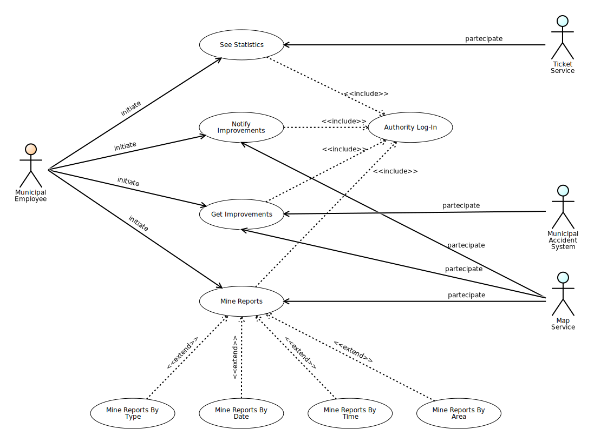
* Local Officer
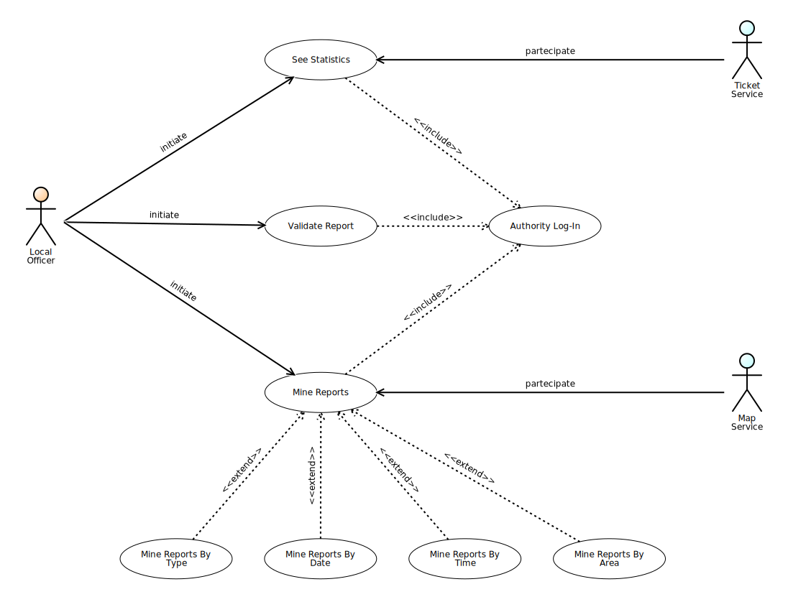
### 3.2.3. Use Cases 
#### 3.2.3.1. Sign-Up
| | |
|-|-|
!Name |Sign-Up !
!Actors |Unregistered User !
!Entry Conditions |The UU is already on the Log-In page. !
!Event Flow | 1. The UU clicks on the "Sign-Up" field to start the registration process. |
| | 1. The UU provides his/her email address. |
| | 1. The UU provides a username. |
| | 1. The UU provides a password and writes it again for confirmation. |
| | 1. The UU clicks on the confirmation button. |
| | 1. The system saves the data. !
!Exit Conditions |The UU becomes now a RU.  From now on he/she can Log-In into the application and use SafeStreets service. !
!Exceptions | 1. The UU is already an user. |
| | 1. The UU provides a username already used.   In the case 1 an error message is displayed, saying "Credentials already in use, please Log-In", and the UU is taken back to the Log-In page.   In the case 2 an error message is displayed, saying "Username already in use, please choose a different one", and the UU is taken back to the point 2. ! 
#### 3.2.3.2. Registered User Log-In
| | |
|-|-|
!Name |Registered User Log-In !
!Actors |Registered User !
!Entry Conditions |The RU is already on the Log-In page. !
!Event Flow | 1. The RU provides his/her username or email. |
| | 1. The RU provides his/her password. |
| | 1. The RU clicks on the confirmation button.  |
| | 1. The system redirects the RU to the corresponding home page. !
!Exit Conditions |The RU is successfully redirected to the corresponding home page. !
!Exceptions | 1. The RU provides an incorrect username, email or password.   In the case 1 an error message is displayed, saying "Wrong Credentials", and the RU is taken back to the point 1. !
#### 3.2.3.3. Add Report                                                                             
| | |
|-|-|
!Name |Add Report !
!Actors |Registered User !
!Entry Conditions |The RU has logged in and is in the home page, which is the "Get My Reports" page !
!Event Flow | 1. The RU clicks on the "Add Report" button. |
| | 1. The RU takes a photo of the car through his/her device's camera and goes to the next phase. |
| | 1. The RU highlight the plate of the reported car and goes to the next phase. |
| | 1. The RU adds one or more type of violations and confirms. |
| | 1. The system receives the report and stores it. !
!Exit Conditions |The RU successfully uploads a new report into the system. Then he/she is taken back to the home page. !
!Exceptions |There are no exceptions under the given domain assumptions. !
#### 3.2.3.4. Get My Reports
| | |
|-|-|
!Name | Get My Reports !
!Actors | Registered User, Map Service !
!Entry Conditions | The RU has logged in and is in the home page, which is "Get My Reports" page. !
!Event Flow | 1. The system automatically provides the RU with the reports he/she has sent, sorted in chronological order, starting from the newest one. |
| | 1. Eventually the RU is able to open a report, see all its information, with the position provided by the MS, and see its status. !
!Exit Conditions | The RU successfully gets his/her reports and is able to navigate through them. !
!Exceptions | 1. The RU has never uploaded any report.   The case 1 is handled by showing only the "Add Report" button. !
#### 3.2.3.5. Get Violations Type By Area
| | |
|-|-|
!Name |Get Violations Type By Area !
!Actors |Registered user, Map Service !
!Entry Conditions |The RU has logged in and is in the home page, which is the "Get My Reports" page. !
!Event Flow | 1. The RU has to swipe to the "Get violations Type By Area" page. |
| | 1. Once in the correct page, the RU has to provide an address or use his/her current GPS location. |
| | 1. A map with the violations, shown as points, is displayed. The map is provided by the MS. !
!Exit Conditions |The RU now is able to browse on the map between violations and see their type. !
!Exceptions | 1. The RU provides an invalid address.   In the case 1 an error message is displayed, saying "Invalid address", and the RU is taken back to the point 2. !
#### 3.2.3.6. Authority Log-In
| | |
|-|-|
!Name | Authority Log-In !
!Actors |Municipal Employee, Local Officer !
!Entry Conditions |The ME/LO is already on the Log-In page. !
!Event Flow | 1. The ME/LO provides his/her username or email. |
| | 1. The ME/LO provides his/her password. |
| | 1. The ME/LO chooses his/her type: "Municipal Employee" or "Local Officer". |
| | 1. The ME/LO clicks on the confirmation button.  |
| | 1. The system redirects the ME/LO to the corresponding home page. !
!Exit Conditions |The ME/LO is successfully redirected to the home page. !
!Exceptions | 1. The ME/LO provides an incorrect username, email or password.   In the case 1 an error message is displayed, saying "Invalid credentials", and the ME/LO is taken back to the point 1. !
#### 3.2.3.7. Get Improvements
| | |
|-|-|
!Name |Get Improvements !
!Actors |Municipal Employee, Municipal Accident System, Map Service  !
!Entry Conditions |The ME has logged in and is in the home page. !
!Event Flow | 1. The ME clicks on the "Get Improvements" function. |
| | 1. The system cross its information with the MAS and finds all the possible improvements in the ME's municipality. |
| | 1. The system sends the information to the ME.|
| | 1. The possible improvements are shown in a descendant list on the left, starting from the most urgent one.  A map with the possible improvements, shown as points, is displayed on the right, thanks to the MS. |
| | 1. The ME can click on a improvements and see it highlighted on the map. !
!Exit Conditions |The ME can browse through all the possible improvements in his/her municipality. !
!Exceptions | * 1 There are no possible improvements.   In the case 1 an error message is displayed, saying "There is not enough data to generate improvements", and the ME/LO is taken back to the home page.!
#### 3.2.3.8. See Statistics
| | |
|-|-|
!Name | See Statistics !
!Actors | Municipal Employee, Local Officer, Ticket Service !
!Entry Conditions | The ME/LO has logged in and is in the home page. !
!Event Flow | 1. The ME/LO clicks on the "See Statistics" function. |
| | 1. The system creates statistics based on the reports it has stored and the tickets issued through the Ticket Service. |
| | 1. The system sends the statistics to the ME/LO. |
| | 1. The ME/LO can see and download the received statistics. !
!Exit Conditions | The ME/LO successfully receives the statistics provided by the system. !
!Exceptions | 1. The system has no data to build statistics on.   In the case 1 an error message is displayed, saying "There is not enough data to create statistics", and the ME is taken back to the home page. !
#### 3.2.3.9. Mine Reports By Type
| | |
|-|-|
!Name | Mine Reports By Type!
!Actors | Municipal Employee, Local Officer, Map Service!
!Entry Conditions | The ME/LO has logged in and is in the home page. !
!Event Flow | 1. The ME/LO clicks on the "Mine Reports" function. |
| | 1. The ME/LO chooses the "Mine By Type" option. |
| | 1. The ME/LO decides one or more types of violations to retrieve. |
| | 1. The system provides the ME/LO with all the violations in his/her municipality, with at least one of the given types. |
| | 1. Only the violation types are shown, in a list on the left, starting from the newest one.  A map with violation types, shown as points, is displayed on the right, thanks to the MS.!
!Exit Conditions | The ME/LO is able to search through the violations and see where and when they happened. !
!Exceptions | 1. There are no reports with at least one of the given violation type.   In the case 1 an error message is displayed, saying "There are no Violations to be displayed", and the ME/LO is taken back to the home page. !
#### 3.2.3.10. Mine Reports By Date
| | |
|-|-|
!Name | Mine Reports By Date!
!Actors | Municipal Employee, Local Officer, Map Service!
!Entry Conditions | The ME/LO has logged in and is in the home page. !
!Event Flow | 1. The ME/LO clicks on the "Mine Reports" function. |
| | 1. The ME/LO chooses the "Mine By Date" option. |
| | 1. The ME/LO decides the specific date of the violations to retrieve. |
| | 1. The system provides the ME/LO with all the violations in his/her municipality that were issued in the specific day. |
| | 1. Only the violation types are shown, in a list on the left.  A map with violation types, shown as points, is displayed on the right, thanks to the MS.!
!Exit Conditions | The ME/LO is able to search through the violations and see where they happened. !
!Exceptions | 1. There are no reports issued in the specific date.   In the case 1 an error message is displayed, saying "There are no Violations to be displayed", and the ME/LO is taken back to the home page. !
#### 3.2.3.11. Mine Reports By Time
| | |
|-|-|
!Name | Mine Reports By Time!
!Actors | Municipal Employee, Local Officer, Map Service!
!Entry Conditions | The ME/LO has logged in and is in the home page. !
!Event Flow | 1. The ME/LO clicks on the "Mine Reports" function. |
| | 1. The ME/LO chooses the "Mine By Time" option. |
| | 1. The ME/LO decides the time (expressed in hours, i.e. 8 pm) for the violations he/she wants to retrieve. |
| | 1. The system provides the ME/LO with all the violations in his/her municipality that were issued at the specific time. |
| | 1. Only the violation types are shown, in a list on the left.  A map with violation types, shown as points, is displayed on the right, thanks to the MS.!
!Exit Conditions | The ME/LO is able to search through the violations and see where they happened !
!Exceptions | 1. There are no reports issued at the specific time.   In the case 1 an error message is displayed, saying "There are no Violations to be displayed", and the ME/LO is taken back to the home page. !
#### 3.2.3.12. Mine Reports By Area
| | |
|-|-|
!Name | Mine Reports By Area!
!Actors | Municipal Employee, Local Officer, Map Service!
!Entry Conditions | The ME/LO has logged in and is in the home page. !
!Event Flow | 1. The ME/LO clicks on the "Mine Reports" function. |
| | 1. The ME/LO chooses the "Mine By Area" option. |
| | 1. The ME/LO decides the address, or selects a point on a map provided by the MS, of the violations to retrieve and select the radius of the search. |
| | 1. The system provides the ME/LO with all the violations in his/her municipality that were issued within the specified radius. |
| |1. Only the violation types are shown, in a list on the left, starting from the newest one.  A map with violation types, shown as points, is displayed on the right, thanks to the MS.!
!Exit Conditions | The ME/LO is able to search through the violations and see when they happened !
!Exceptions | 1. There are no reports issued in the specific area.   In the case 1 an error message is displayed, saying "There are no Violations to be displayed", and the ME/LO is taken back to the home page. !
#### 3.2.3.13. Validate Reports
| | |
|-|-|
!Name | Validate Reports!
!Actors | Local Officer, Ticket Service!
!Entry Conditions | The LO has logged in and is in the home page. !
!Event Flow | 1. The LO clicks on the "Validate Report" function. |
| | 1. The system provides the LO with all the reports of his/her municipality still not verified. |
| | 1. The reports are shown starting from the newest one.|
| | 1. The LO clicks on one report and is able to validate or invalidate it. |
| | 1. Eventually the LO uses the report data to create a new ticket and add it to the TS. !
!Exit Conditions | The LO is able to browse through the reports and validate or invalidate them!
!Exceptions | 1. There are no reports in LO's municipality.   In the case 1 an error message is displayed, saying "There are no Reports to be displayed", and the LO is taken back to the home page. !
### 3.2.4. Sequence Diagrams 

* Unregistered User
    * Sign-Up
    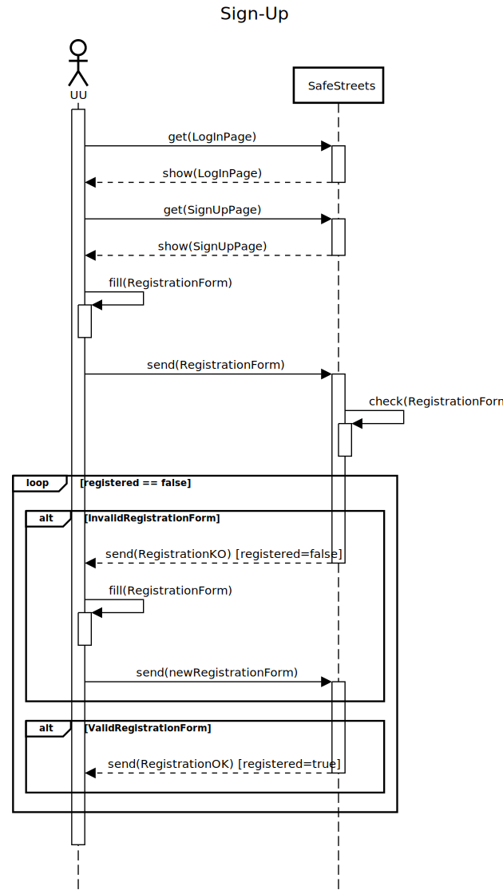
* Registered User
    * Log-In
    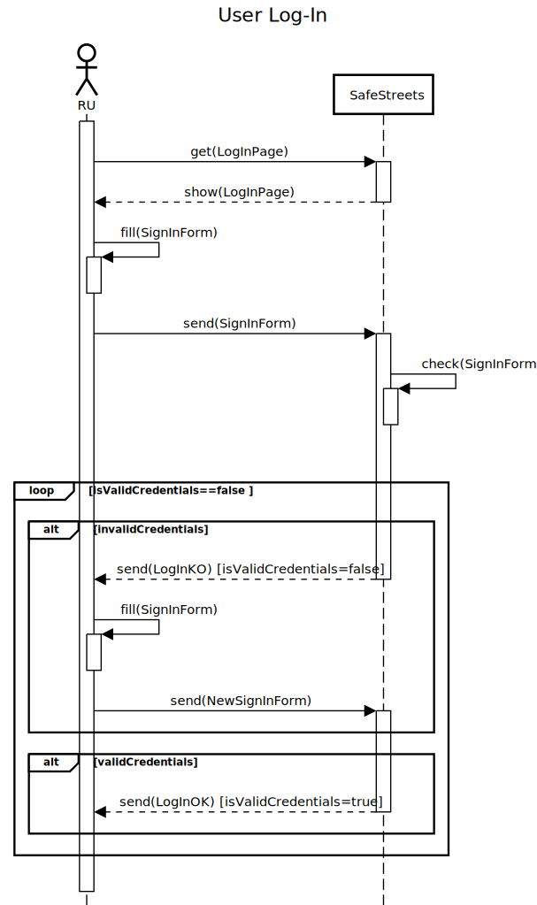
    * Get My Reports
    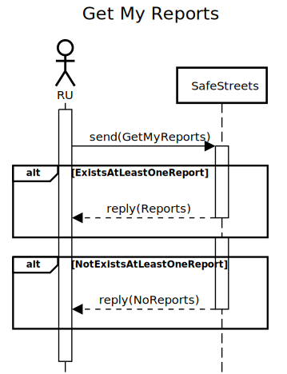
    * Get Unsafe Areas
    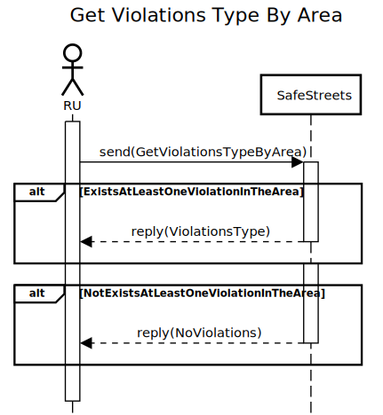
    * Add Report
    
* Authority
    * Log-In
    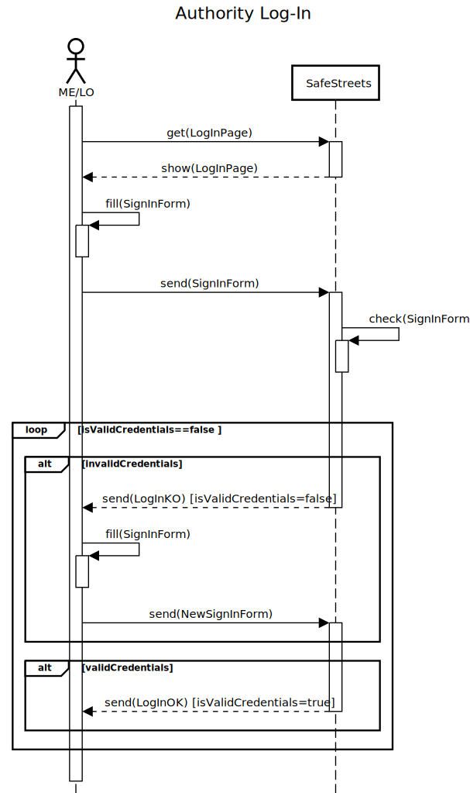
    * Mine Reports By *
    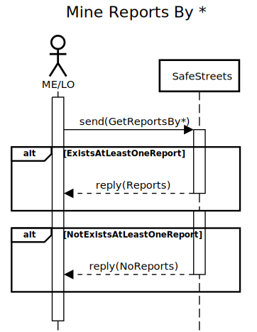 
    * See Statistics
    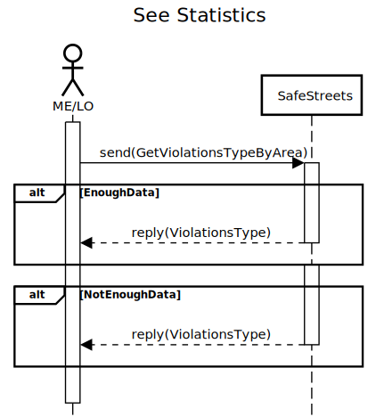        
* Municipal Employee
    * Get Improvements
    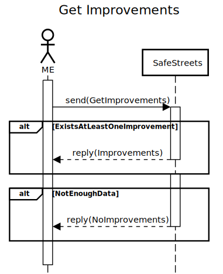
* Local Officer
    * Validate Reports
    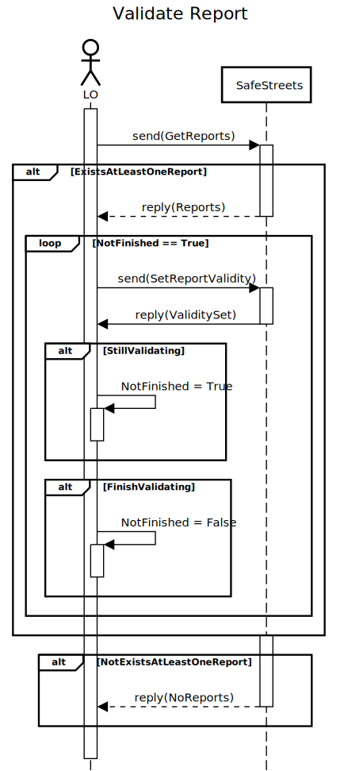

### 3.2.5. Mapping Requirements

## 3.3. Performance Requirements
The system does not have any particular performance requirements. Obviously it will be able to handle multiple request from multiple clients (users and authorities).
## 3.4. Design Constraints
### 3.4.1. Standards Compliance 
### 3.4.2. Hardware Limitations
### 3.4.3. Any other Constraints
## 3.5. Software Systems Attributes
### 3.5.1. Reliability
### 3.5.2. Availability
### 3.5.3. Security
### 3.5.4. Maintainability
### 3.5.5. Portability
